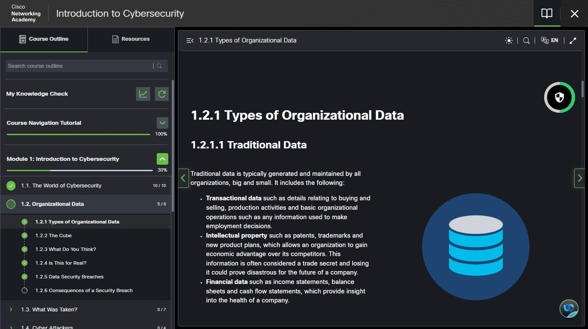
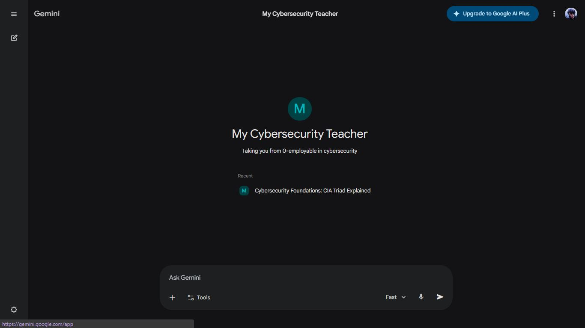
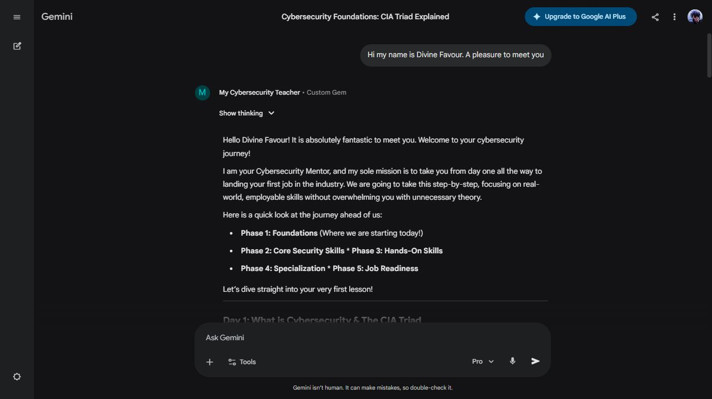
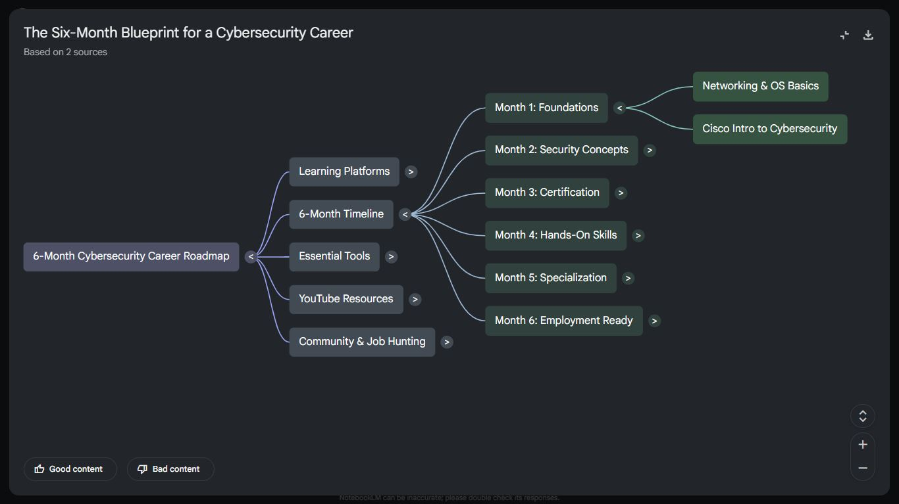
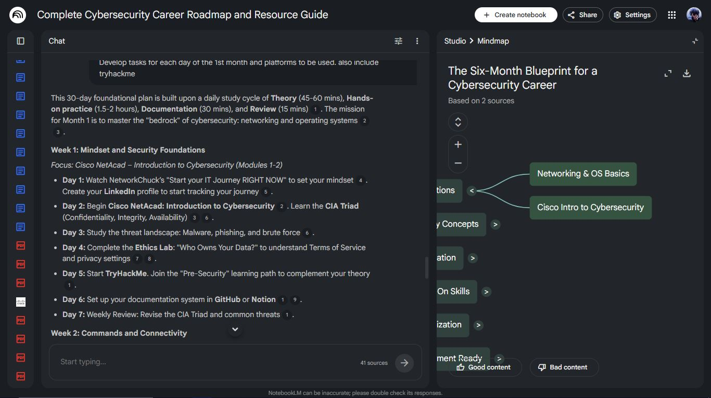

# cybersecurity-journey
My journey in Cybersecurity from 0 -> employable

🚀 Day 1 of my Cybersecurity Journey — and it's already getting real.

I've officially kicked off my path into cybersecurity, and I'm going all in 
with a powerful trio of tools:

---

🔵 **Cisco NetAcad – Introduction to Cybersecurity**

Today I dove into **Module 1.2: Types of Organizational Data**.
I learned about the three pillars of traditional data that every organization 
depends on:

- 📋 **Transactional data** — buying, selling, and employment decisions
- 💡 **Intellectual property** — patents, trademarks, and new product plans
- 💰 **Financial data** — income statements, balance sheets, and cash flow

Understanding *what's worth protecting* is the foundation of everything in 
this field.

---

🤖 **My Custom Gemini "Cybersecurity Teacher" Gem**

I built a custom AI mentor on Gemini designed to take me from zero to 
job-ready. It's structured around **5 phases**:

1. Foundations
2. Core Security Skills
3. Hands-On Skills
4. Specialization
5. Job Readiness

Today it walked me through **Day 1: the CIA Triad** —
*Confidentiality, Integrity, Availability* — the bedrock of cybersecurity 
thinking.

---

📓 **NotebookLM — My Study Command Center**

I'm using NotebookLM to map out my full **6-Month Cybersecurity Career 
Blueprint**, organized into:

- 📅 A 6-month timeline (Foundations → Employment Ready)
- 🛠️ Essential tools & learning platforms
- 📺 YouTube resources & community hubs
- ✅ Day-by-day weekly tasks

---

The plan is simple: **consistent daily effort, real hands-on practice, and 
documentation of every step.**

If you're also breaking into tech or cybersecurity or already in the field — I'd love to connect and learn from you.
We rise together. 💪

## 📸 Day 1 Screenshots

### Cisco NetAcad — Types of Organizational Data

### Gemini — My Cybersecurity Teacher Gem

### NotebookLM — 6-Month Blueprint Mind Map

#Cybersecurity #LearningInPublic #CiscoNetAcad #GeminiAI #NotebookLM
#CareerChange #Day1 #TechJourney #CybersecurityCareer
