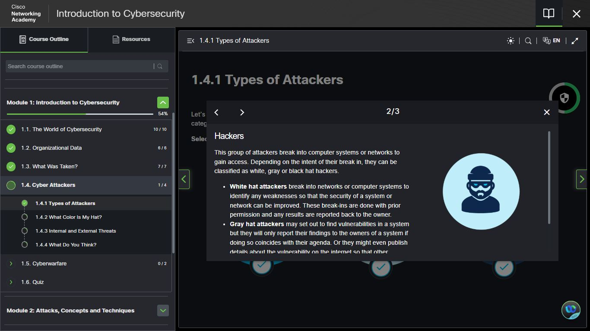
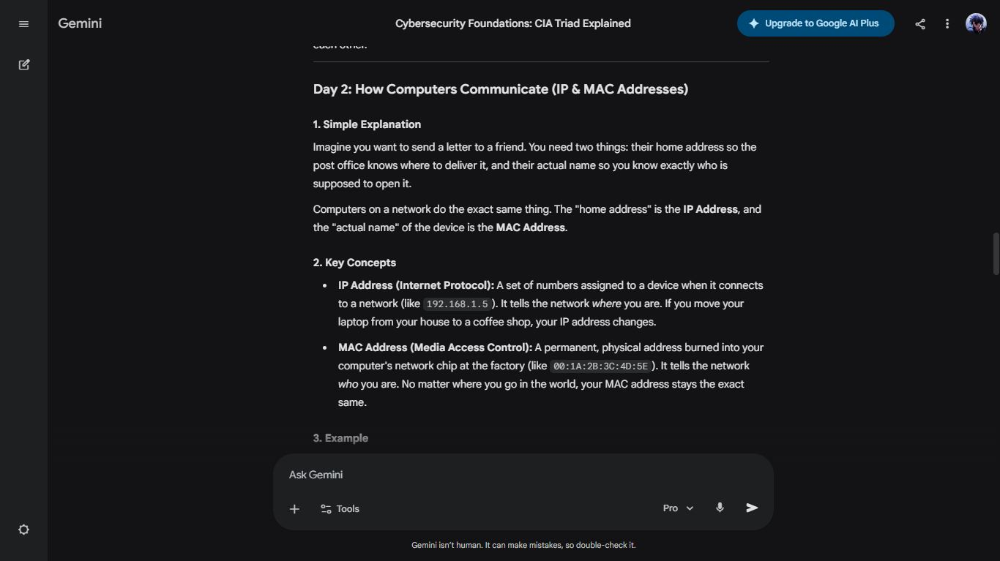
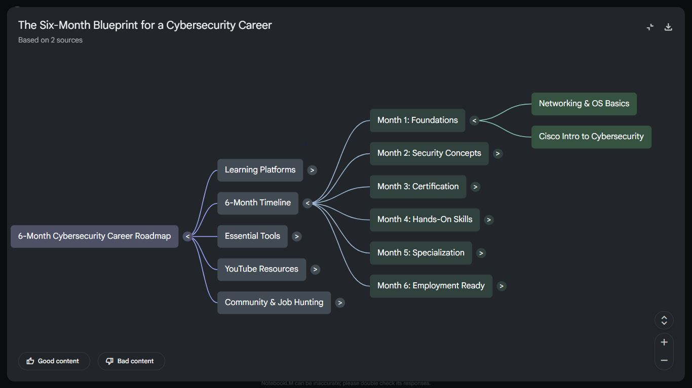

# Day 2 — Types of Attackers & Networking Basics

**Date:** 
**Course:** Cisco NetAcad — Introduction to Cybersecurity
**Topics:** Cyber Attackers | IP Addresses | MAC Addresses | ipconfig

---

## 🎩 Types of Cyber Attackers

| Hat | Type | Intent | Legal? |
|-----|------|--------|--------|
| ⚪ | Script Kiddie | Disruption using others' tools | ❌ No |
| ⬛ | Black Hat | Personal gain, data theft | ❌ No |
| 🤍 | White Hat | Ethical hacking, find vulnerabilities | ✅ Yes |
| 🩶 | Grey Hat | Hacks without permission but discloses | ⚠️ Mostly No |

### Key Takeaways
- **Script Kiddies** lack technical skill but can still cause real damage
- **Black Hats** are motivated by money, revenge, or espionage
- **White Hats** are the same skill set — different ethics. This is a career.
- **Grey Hats** operate in a legal grey zone — good intentions ≠ legal action

---

## 🌐 IP Address vs MAC Address

| | IP Address | MAC Address |
|-|------------|-------------|
| **What it is** | Network location | Hardware identity |
| **Changes?** | Yes (dynamic) | No (permanent) |
| **Format** | 192.168.1.1 | 00:1A:2B:3C:4D:5E |
| **Layer** | Network Layer (L3) | Data Link Layer (L2) |
| **Assigned by** | Router/ISP | Manufacturer |

---

## 💻 Hands-On: ipconfig on Windows

Opened Command Prompt (cmd) and ran:

```bash
ipconfig
```

### Output included:
- **IPv4 Address** — my device's current IP on the network
- **Subnet Mask** — defines the network range
- **Default Gateway** — the router's IP address

> 💡 To see your MAC address too, run: `ipconfig /all`


##Screenshots##

## 📸 Day 2 Screenshots

### Cisco NetAcad — Types of Attackers


### Gemini — My Cybersecurity Teacher Gem (IP & MAC addresses)


### NotebookLM — 6-Month Blueprint Mind Map


---

## ✅ Summary
- Learned the 4 types of hackers and their motivations
- Understood the difference between IP and MAC addresses
- Used ipconfig on Windows Command Prompt to find real network data

---

*[← Day 1](day-01.md) | [Day 3 →](day-03.md)*
