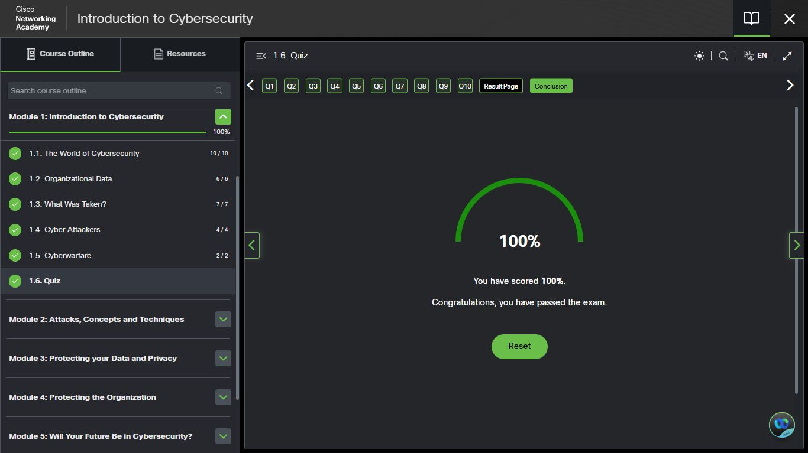
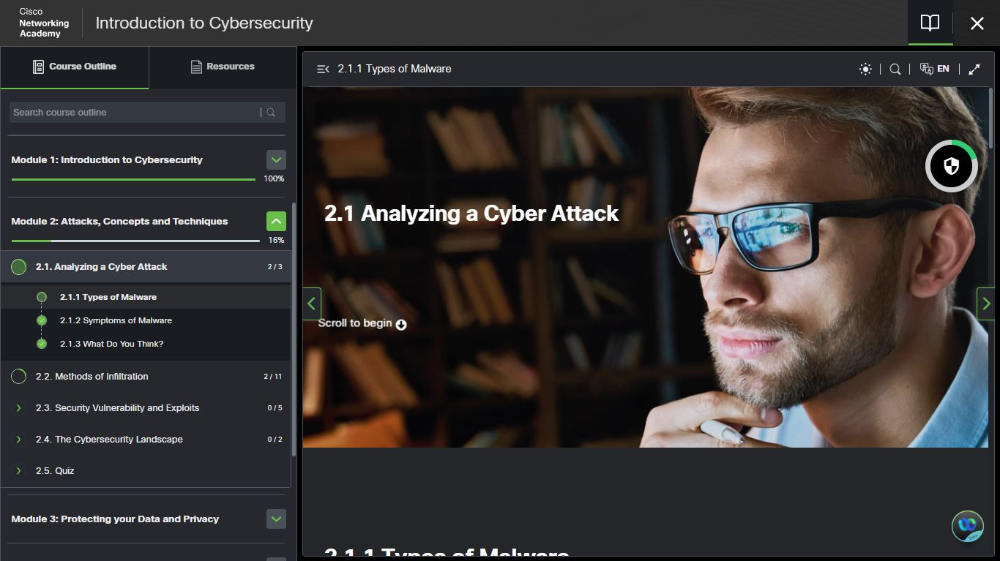

# 🎯 Module 1 Complete — Cisco NetAcad (Introduction to Cybersecurity)

## ✅ Progress
Completed Module 1 with a **100% quiz score**

### Sections Covered:
- 1.1 The World of Cybersecurity (10/10)
- 1.2 Organizational Data (6/6)
- 1.3 What Was Taken? (7/7)
- 1.4 Cyber Attackers (4/4)
- 1.5 Cyberwarfare (2/2)

---

## 🧠 Key Learnings
- Types of attackers:
  - Script Kiddies
  - White Hat, Black Hat, Grey Hat
- Importance of protecting organizational data  
- Cyberwarfare as a modern threat  
- Networking basics:
  - IP Address vs MAC Address  
  - Used `ipconfig` to check my IP  

---

## 📸 Day 3 Screenshots

### Cisco NetAcad — Module 1 quiz completed

### Cisco NetAcad — Module 2

### NotebookLM — 6-Month Blueprint Mind Map

---

## 💡 Insight
Cybersecurity is not only technical—it is also human.  
Attackers often exploit people, not just systems.

---

## 🚀 Next Steps
- Start Module 2: Attacks, Concepts & Techniques  
- Continue daily learning + hands-on practice  

---

## 📅 Progress Tracker
Day 1 ✅  
Day 2 ✅  
Day 3 ✅  
Module 1 ✅  
