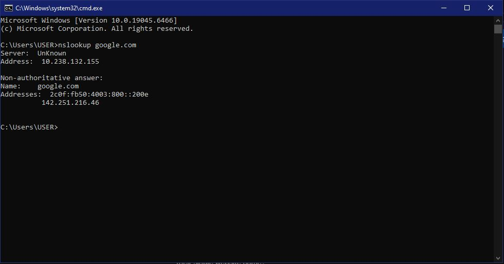
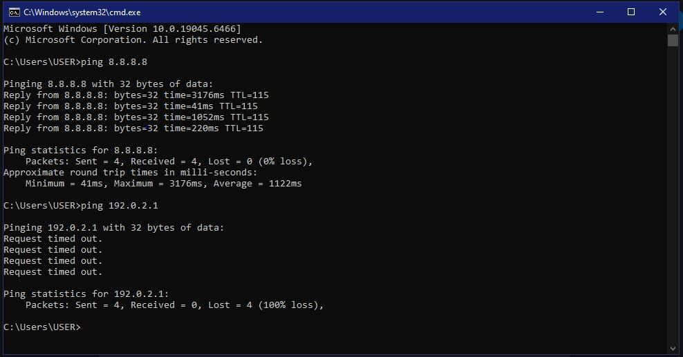
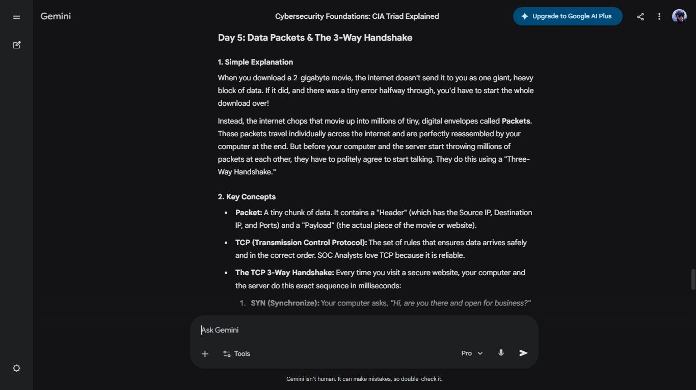
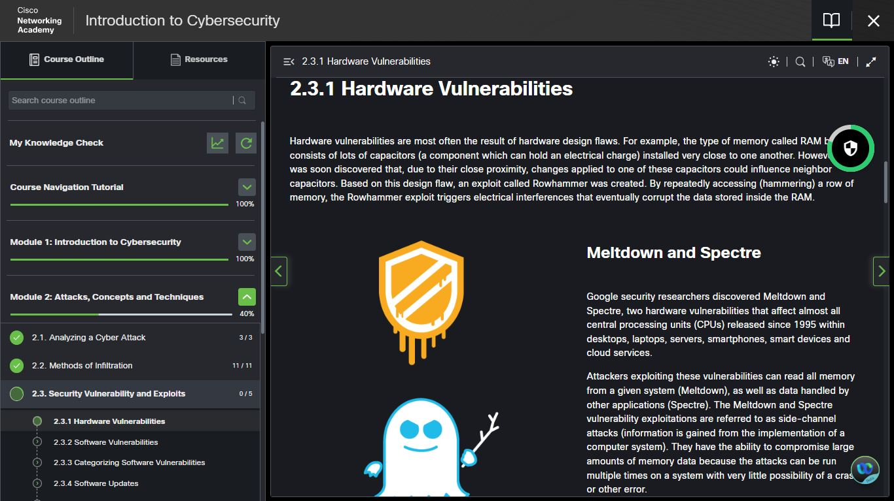

# Day 5 — Data Packets, TCP Handshake, Hardware Vulnerabilities & DNS Lab

**Date:** <!-- insert date -->
**Platform:** Cisco NetAcad — Module 2.3 | Gemini Cybersecurity Teacher Gem
**Topics:** Data Packets | TCP 3-Way Handshake | Hardware Vulnerabilities | nslookup | ping

---

## 📦 Data Packets & TCP 3-Way Handshake

**Packet structure:**
| Component | Contains |
|-----------|----------|
| **Header** | Source IP, Destination IP, Ports |
| **Payload** | The actual data being transmitted |

**TCP 3-Way Handshake — connection establishment sequence:**

Client          Server
|--- SYN ------->|   "Are you there and ready?"
|<-- SYN-ACK ----|   "Yes. Are you?"
|--- ACK ------->|   "Let's go."

> TCP is the protocol of choice for SOC Analysts because it is 
> reliable — every packet is acknowledged and sequenced.
> Any deviation from this handshake pattern is a potential 
> indicator of a SYN flood attack or port scanning activity.

---

## 🔩 Hardware Vulnerabilities — Cisco NetAcad 2.3.1

| Vulnerability | Attack Method | Scope |
|---------------|--------------|-------|
| **Rowhammer** | Hammers RAM rows to cause electrical interference, corrupting neighbouring memory | Local system |
| **Meltdown** | Side-channel attack — reads all memory from a system | Every CPU since 1995 |
| **Spectre** | Side-channel attack — reads data across applications | Every CPU since 1995 |

> Side-channel attacks extract information from the physical 
> implementation of hardware — not software flaws.
> Meltdown & Spectre affect desktops, servers, smartphones,
> and cloud infrastructure globally.

---

## 💻 Hands-On Lab: nslookup & ping

### Lab 1 — DNS Resolution with nslookup

```bash
nslookup google.com
```

**Output:**

Server:   UnKnown
Address:  10.238.132.155
Non-authoritative answer:
Name:     google.com
Addresses: 2c0f:fb50:4003:800::200e   ← IPv6
142.251.216.46              ← IPv4

**What this proves:**
- The local DNS server (`10.238.132.155`) resolved `google.com`
- Returned both an IPv4 and IPv6 address for Google
- "Non-authoritative answer" means the result came from 
  the DNS cache, not Google's own nameserver directly
- This is DNS working in real time — theory made observable

---

### Lab 2 — Connectivity Testing with ping

```bash
ping 8.8.8.8
```

**Result:** ✅ 4 sent | 4 received | 0% packet loss
Host is reachable. Google's public DNS server responded.

```bash
ping 192.0.2.1
```

**Result:** ❌ 4 sent | 0 received | 100% packet loss
Request timed out. `192.0.2.1` is a reserved, 
non-routable IP — it does not exist on the public internet.

---

### Why This Matters for SOC Analysts

| Command | SOC Use Case |
|---------|-------------|
| `nslookup` | Investigate suspicious domains, verify DNS resolution, detect DNS hijacking |
| `ping` | Confirm host availability, identify unreachable or spoofed addresses |

These are among the first tools a Tier 1 SOC Analyst 
reaches for when investigating an alert or verifying 
a connection. Both executed successfully on Day 5.

---

## 📸 Screenshots





---

## ✅ Summary
- Data packets carry a header (IPs + ports) and payload (data)
- TCP 3-Way Handshake (SYN → SYN-ACK → ACK) establishes 
  every reliable connection
- Rowhammer, Meltdown & Spectre are hardware-level attack 
  vectors with global reach
- `nslookup google.com` resolved live IPv4 and IPv6 addresses
- `ping 8.8.8.8` confirmed connectivity | `ping 192.0.2.1` 
  confirmed an unreachable host — 100% packet loss

---

*[← Day 4](day-04.md) | [Day 6 →](day-06.md)*
