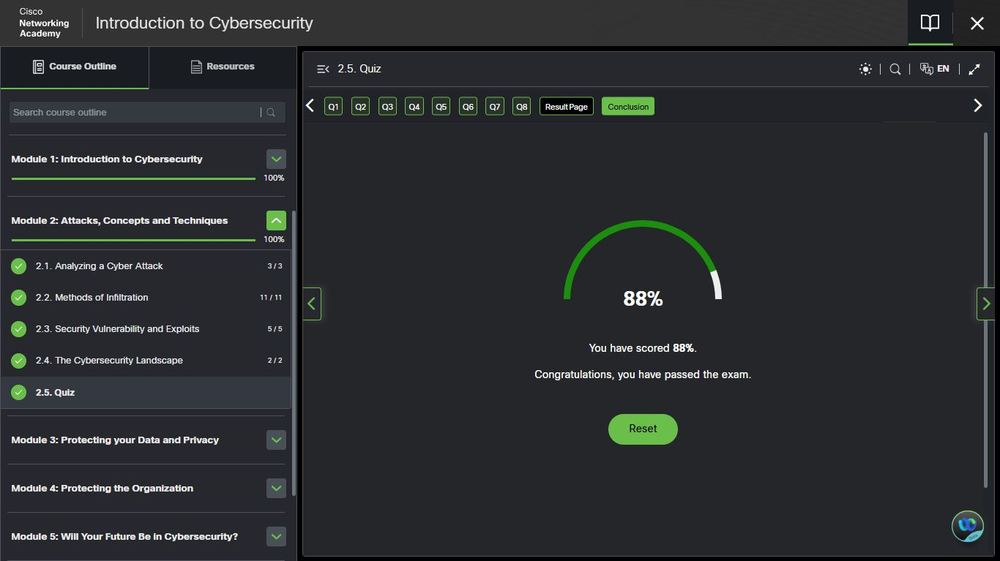
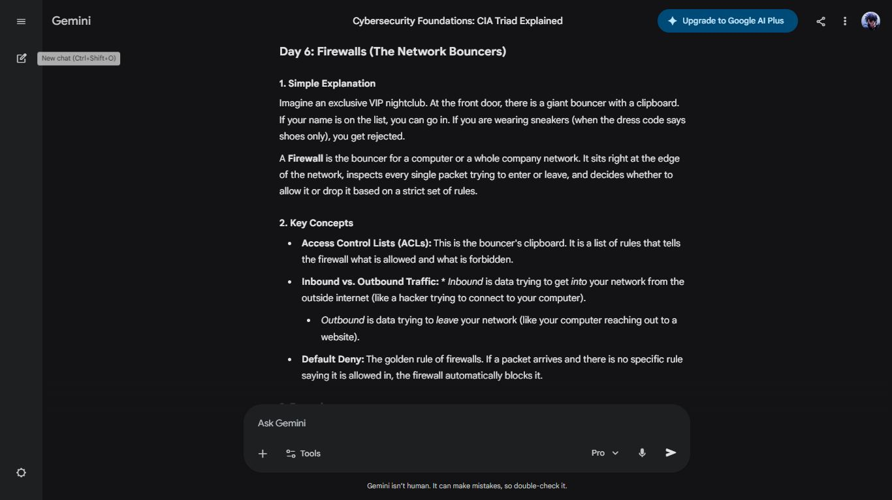
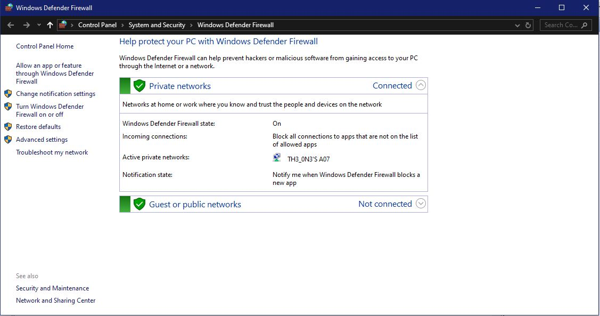
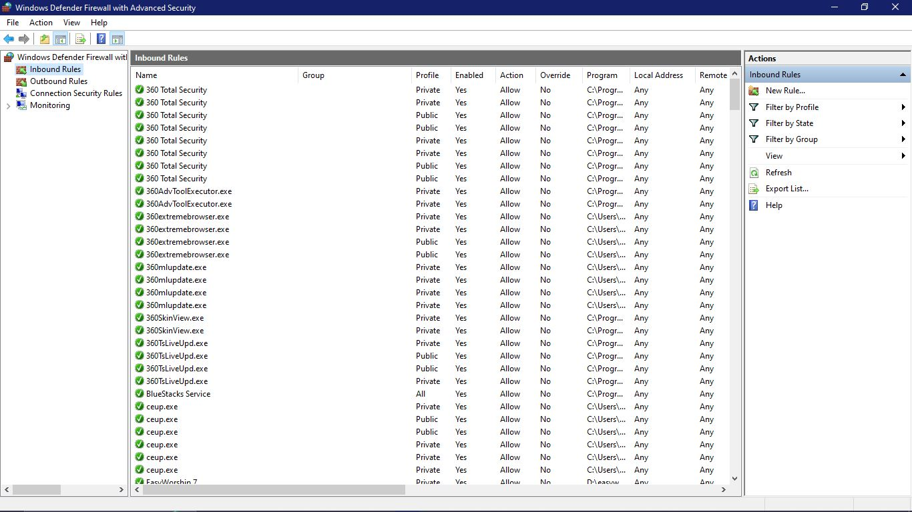

# Day 6 — Firewalls & Module 2 Completion

**Date:** <!-- 24/04/2026 -->
**Platform:** Cisco NetAcad — Module 2.5 | Gemini Cybersecurity Teacher Gem
**Milestone:** Module 2: Attacks, Concepts and Techniques — Complete ✅
**Quiz Score:** 88% — Passed
**Topics:** Firewalls | ACLs | Inbound vs Outbound | Default Deny

---

## 🏆 Module 2 Completion

| Section | Score | Status |
|---------|-------|--------|
| 2.1 Analyzing a Cyber Attack | 3/3 | ✅ |
| 2.2 Methods of Infiltration | 11/11 | ✅ |
| 2.3 Security Vulnerability and Exploits | 5/5 | ✅ |
| 2.4 The Cybersecurity Landscape | 2/2 | ✅ |
| 2.5 Quiz | 88% | ✅ Passed |

> One question missed — identified for review.
> A score is only useful if the gaps are understood.

---

## 🛡️ Firewalls — Gemini Cybersecurity Teacher Gem

A firewall sits at the network edge inspecting every packet 
with one outcome: **Allow** or **Block**.

### Access Control Lists (ACLs)
An ordered rulebook evaluated sequentially for every packet.
Defines precisely what traffic is permitted or forbidden.

### Inbound vs Outbound Traffic

| Direction | Definition | SOC Relevance |
|-----------|------------|---------------|
| **Inbound** | External data entering the network | Monitor for unauthorised access |
| **Outbound** | Internal data leaving the network | Monitor for exfiltration & C2 traffic |

### Default Deny
> If no explicit rule permits a connection,
> it is automatically blocked.
> Nothing is trusted unless explicitly authorised.

---

## 💻 Hands-On Lab: Windows Defender Firewall with Advanced Security

### Basic Panel — Observed Configuration

| Setting | Value |
|---------|-------|
| Firewall State | **On** |
| Incoming Connections | Block all not on allowed list |
| Active Private Network | TH3_0N3'S A07 |
| Guest/Public Network | Not connected |

**Default Deny confirmed live on my system.**

---

### Advanced Security — Inbound Rules

Navigated beyond the basic panel into **Advanced Security**
and examined the live inbound rules table.

**Key Observations:**
- Each application has a dedicated inbound rule specifying
  Profile (Private/Public/All), Enabled status, Action, 
  and exact Program path
- Same application can be permitted on Private but 
  restricted on Public network — context determines trust
- Multiple system and security tools visible, each 
  governing a specific inbound traffic pathway

**SOC Analyst relevance:**
- Identify overly permissive rules (Allow Any → Any)
- Detect unauthorised rules added by malware
- Spot applications communicating on unexpected ports

---

## 📸 Screenshots

---

## ✅ Summary
- Firewalls enforce Allow/Block on every packet via ACLs
- Inbound monitors threats | Outbound monitors exfiltration
- Default Deny confirmed active on my own machine
- Examined live inbound rules in Advanced Security —
  application-specific, profile-scoped, on a real system
- Module 2 complete | 88% quiz score

---

## 📅 Progress Tracker
Day 1 ✅  
Day 2 ✅  
Day 3 ✅  
Day 4 ✅  
Day 5 ✅  
Day 6 ✅  

Module 1 ✅  
Module 2 ✅  

---

*[← Day 5](day-05.md) | [Day 7 →](day-07.md)*
