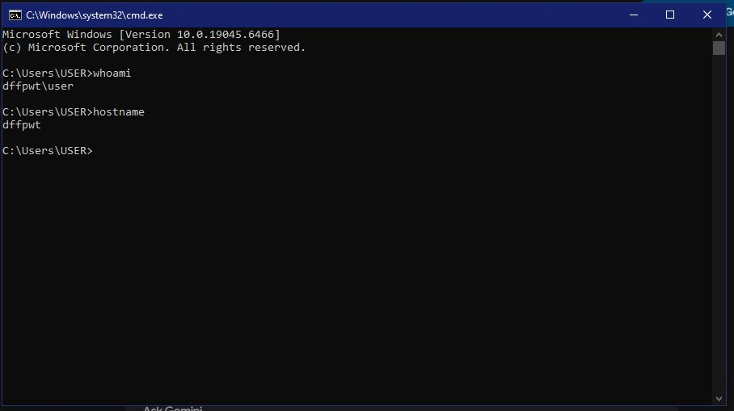
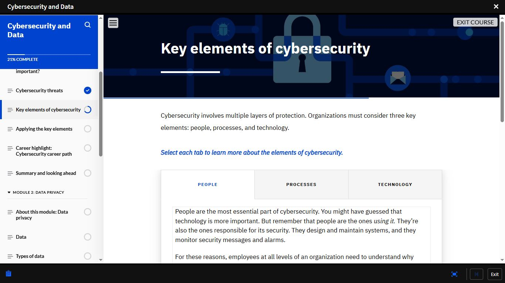
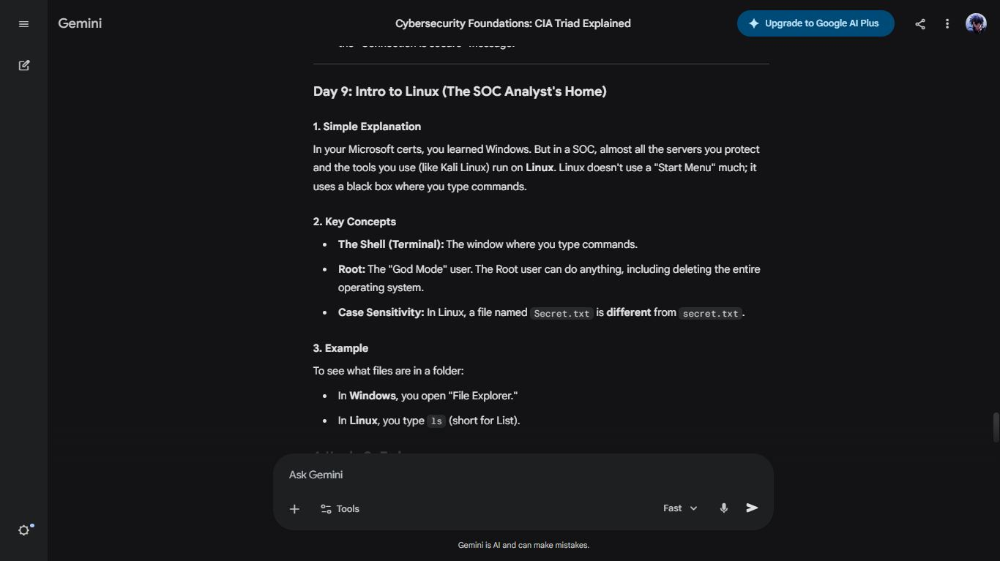

# Day 9 — People, Process & Technology | Windows & Linux Fundamentals

**Date:** <!-- insert date -->
**Platform:** IBM SkillsBuild — Cybersecurity and Data | Gemini Cybersecurity Teacher Gem
**Topics:** Three Pillars | whoami & hostname | Linux Shell | 
Root Access | Case Sensitivity

---

## 🧩 The Three Pillars of Cybersecurity

| Pillar | Role | Primary Weakness |
|--------|------|-----------------|
| **People** | Operate and configure all systems | Social engineering, human error |
| **Process** | Ensure consistent security procedures | Absent or ignored documentation |
| **Technology** | Enforce and enable security controls | Only as strong as the people behind it |

> The most sophisticated security stack fails the moment
> someone clicks a phishing link.
> That is a people and process problem — not a technology one.

---

## 💻 Hands-On: Windows Command Prompt

```bash
whoami    # Returns: dffpwt\user
hostname  # Returns: dffpwt
```

| Command | Output | SOC Use Case |
|---------|--------|-------------|
| `whoami` | `dffpwt\user` | Identify active user — detect privilege escalation |
| `hostname` | `dffpwt` | Identify affected machine — correlate with asset inventory |

> Every alert in a SIEM starts with two questions:
> which machine, which user?
> These commands answer both — instantly.

---

## 🐧 Linux Fundamentals — Gemini Cybersecurity Teacher Gem

| Concept | What It Means |
|---------|--------------|
| **The Shell** | Primary command-line interface — Linux mastery is built here |
| **Root Access** | Full, unrestricted system control — highest privilege escalation target |
| **Case Sensitivity** | `Secret.txt` ≠ `secret.txt` — critical difference from Windows |

**Windows vs Linux — Same Task, Different Approach:**

| Action | Windows | Linux |
|--------|---------|-------|
| View folder contents | Open File Explorer | Type `ls` in terminal |
| Full system control | Administrator account | Root account |
| File navigation | GUI-based | Command-line based |

> In a SOC, almost all servers you protect and tools
> you use (like Kali Linux) run on Linux.
> The terminal is not optional — it is home base.

---

## 📸 Screenshots

### 💻 Hands-On — whoami & hostname (Windows CMD)


### 📘 IBM SkillsBuild — Key Elements of Cybersecurity


### 🤖 Gemini Cybersecurity Teacher Gem — Day 9: Intro to Linux


---

## 📊 Progress

| Milestone | Status |
|-----------|--------|
| Module 1 | ✅ Complete |
| Module 2 | ✅ Complete |
| Module 3 | 🔄 In Progress |
| IBM SkillsBuild | ✅ Enrolled & Active |
| Days Completed | 9 / 180 |

---

## ✅ Summary
- All security failures trace to People, Process, or Technology
- `whoami` → `dffpwt\user` | `hostname` → `dffpwt` — 
  system identity confirmed on a real machine
- Linux Shell, root access, and case sensitivity are 
  non-negotiable foundations for SOC work
- IBM SkillsBuild confirmed: People are the most essential 
  element of cybersecurity — technology supports them, 
  not the other way around

---

*[← Day 8](day-08.md) | [Day 10 →](day-10.md)*
