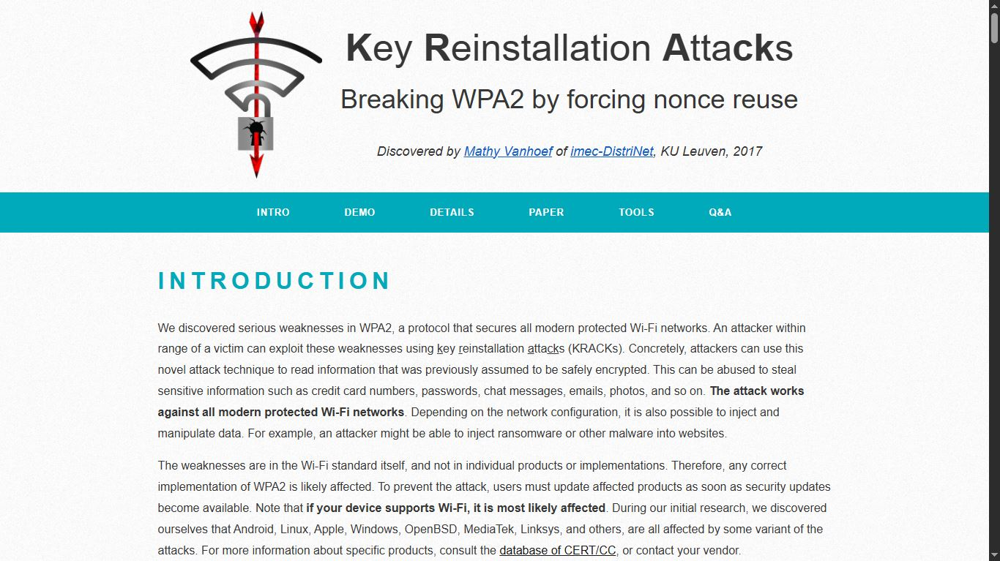
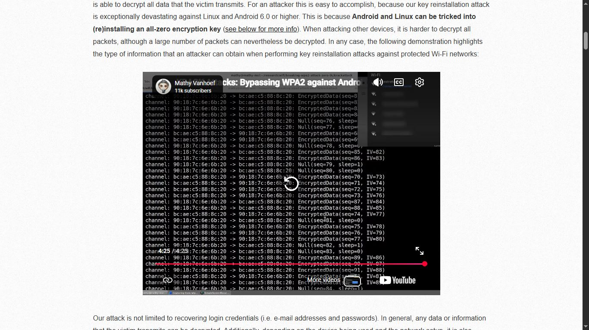
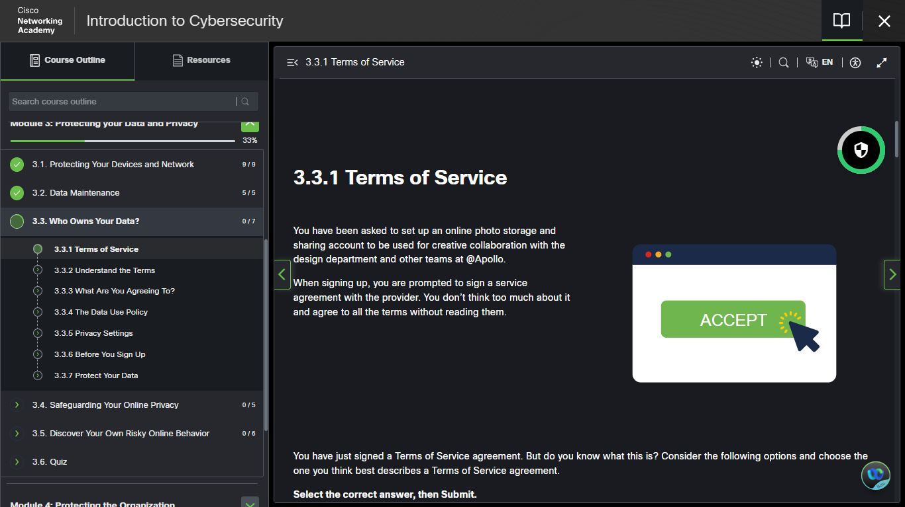

# Day 11 — Extended Review of Day 10

**Date:** <!-- insert date -->
**Platform:** Cisco NetAcad — Module 3 | Gemini Cybersecurity Teacher Gem
**Type:** Deliberate Review Session
**Topics Revisited:** KRACKs | Wireshark | Bluetooth | 
Passphrases | NIST SP 800-63 | Deleted Files

---

## 🔄 Why a Review Day

Moving on after one pass risks surface-level understanding
that breaks down under pressure. Day 11 was a deliberate
second pass through all Day 10 material — re-reading,
re-watching, and clarifying with the Gemini Gem.

> In a SOC environment, the difference between knowing
> a concept and truly understanding it could be the
> difference between catching a threat and missing it.

---

## 📡 KRACKs — Deeper Understanding

**First pass:** Understood that KRACKs breaks WPA2
via nonce reuse.

**Second pass:** Understood the full implication —
the weakness is in the Wi-Fi standard itself, meaning:
- Individual users cannot patch it themselves
- Fixes depend entirely on vendor firmware updates
- Most routers never receive or apply those updates
- The attack window remains open indefinitely for
  unpatched devices

| Pass | Level of Understanding |
|------|----------------------|
| Day 10 | Concept — what KRACKs is |
| Day 11 | Implication — why it remains dangerous at scale |

---

## 📊 Wireshark Demo — Second Viewing

Re-watching the credential capture demo with prior
context changed what was visible:

- **Day 10:** Surprised that credentials appeared in plain text
- **Day 11:** Recognised the pattern — HTTP traffic with
  no encryption layer means every field submitted in a
  form is readable to anyone capturing the traffic

> HTTPS is not a feature. It is the minimum requirement
> for any page that handles user input.

---

## 🤖 Gemini Cybersecurity Teacher Gem — Clarifications

Two concepts from Day 10 that needed consolidation:

### 1. How Nonce Reuse Enables Decryption in KRACKs
- WPA2 uses a unique nonce (number used once) per
  session to generate encryption keys
- KRACKs forces the same nonce to be reused by
  replaying handshake messages
- Reusing a nonce breaks the cryptographic guarantee —
  allowing traffic to be decrypted

### 2. NIST SP 800-63 — Document Distinction

| Document | Focus | Now Clear |
|----------|-------|-----------|
| SP 800-63B | Authentication & Lifecycle Management — how passwords are created, stored, and managed | ✅ |
| SP 800-63C | Federation & Assertions — how identity is shared across systems (e.g. "Sign in with Google") | ✅ |

---

## 📸 Screenshots
*(Same reference material as Day 10 — reviewed again)*

### 📡 KRACKs — Key Reinstallation Attacks

### 📘 Cisco NetAcad — Module 3

### 🔑 NIST Password Regulations

### 📡 FCC — Wi-Fi Security

---

## ✅ Summary
- KRACKs danger lies not just in the attack technique
  but in the reality that most devices remain unpatched
- HTTP pages expose all form input — HTTPS is the
  minimum standard for any user interaction
- Nonce reuse in KRACKs is what breaks WPA2's
  cryptographic guarantee
- NIST SP 800-63B covers authentication management |
  SP 800-63C covers identity federation

---

## 📌 Review Day Principle
> Revision is not wasted time.
> It is how surface-level understanding becomes
> retained knowledge — and retained knowledge is
> what performs under pressure.

---

*[← Day 10](day-10.md) | [Day 12 →](day-12.md)*
