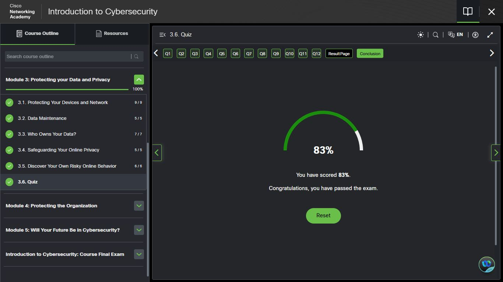
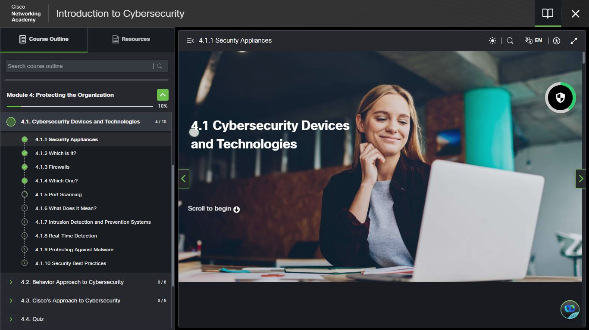

# Day 13 — Module 3 Complete | Module 4: Protecting the Organisation

**Date:** <!-- insert date -->
**Platform:** Cisco NetAcad
**Milestone:** Module 3 Complete ✅ | Module 4 Started 🔄
**Topics:** Module 3 Review | Security Appliances | 
Firewalls | IDS/IPS | Real-Time Detection

---

## 🏆 Module 3 Completion

| Section | Score | Status |
|---------|-------|--------|
| 3.1 Protecting Your Devices and Network | 9/9 | ✅ |
| 3.2 Data Maintenance | 5/5 | ✅ |
| 3.3 Who Owns Your Data? | 7/7 | ✅ |
| 3.4 Safeguarding Your Online Privacy | 5/5 | ✅ |
| 3.5 Discover Your Own Risky Online Behavior | 6/6 | ✅ |
| **3.6 Quiz** | **83%** | ✅ Passed |

> 83% — passed. Questions missed identified for review.
> Moving forward without understanding gaps
> is how surface knowledge breaks under pressure.

---

## 🔄 The Scope Shift — Personal to Organisational

| Personal Security | Organisational Security |
|------------------|------------------------|
| Protect one device | Protect hundreds of devices |
| Protect one user | Protect thousands of users |
| React to personal threats | Proactively monitor infrastructure |
| Individual tools | Enterprise-grade security appliances |

> Individual security asks: how do I protect myself?
> Organisational security asks: how do I protect
> everything and everyone — simultaneously,
> continuously, against threats that never stop?

---

## 🛡️ Module 4 — Protecting the Organisation

### 4.1 Cybersecurity Devices and Technologies

#### Security Appliances (4.1.1)
Dedicated hardware or software systems built specifically
to protect networks — not general-purpose devices
repurposed for security, but purpose-built infrastructure.

#### Firewalls (4.1.3)
Revisited at organisational scale. At this level firewalls
are not single devices but layered systems — perimeter
firewalls, internal segmentation firewalls, and
application-layer firewalls operating simultaneously.

#### Port Scanning (4.1.5)
The technique of probing a network to identify open ports
and the services running on them.

| Context | Purpose |
|---------|---------|
| Attacker | Reconnaissance — find entry points |
| Defender | Audit — identify exposed services |

> The same technique serves both attacker and defender.
> Understanding how port scanning works is essential
> for both penetration testing and network hardening.

#### Intrusion Detection & Prevention Systems (4.1.7)

| System | Function | Response |
|--------|----------|----------|
| **IDS** (Intrusion Detection System) | Monitors traffic and alerts on suspicious activity | Passive — detects and reports |
| **IPS** (Intrusion Prevention System) | Monitors traffic and blocks suspicious activity | Active — detects and stops |

> An IDS tells you someone may be breaking in.
> An IPS locks the door while telling you.
> A SOC Analyst works with both.

---

## 📸 Screenshots

### 📘 Cisco — Module 3 Quiz Result (83%)

### 📘 Cisco — Module 4: Cybersecurity Devices & Technologies

---

## 📊 Overall Progress

| Milestone | Status |
|-----------|--------|
| Module 1: Introduction to Cybersecurity | ✅ Complete |
| Module 2: Attacks, Concepts and Techniques | ✅ Complete |
| Module 3: Protecting Your Data and Privacy | ✅ Complete |
| Module 4: Protecting the Organisation | 🔄 In Progress (10%) |
| IBM SkillsBuild Cybersecurity Programme | ✅ Active |
| Days Completed | 13 / 180 |

---

## ✅ Summary
- Module 3 complete — 83% quiz score across 
  all 5 sections perfect, gaps identified in quiz
- Scope shift: personal security → organisational 
  defence is the defining transition of Module 4
- Security appliances are purpose-built 
  infrastructure — not repurposed general tools
- Port scanning serves both attackers (recon) 
  and defenders (auditing) — same technique, 
  opposite intent
- IDS detects and reports | IPS detects and blocks —
  both are core SOC tools

---

*[← Day 12](day-12.md) | [Day 14 →](day-14.md)*
