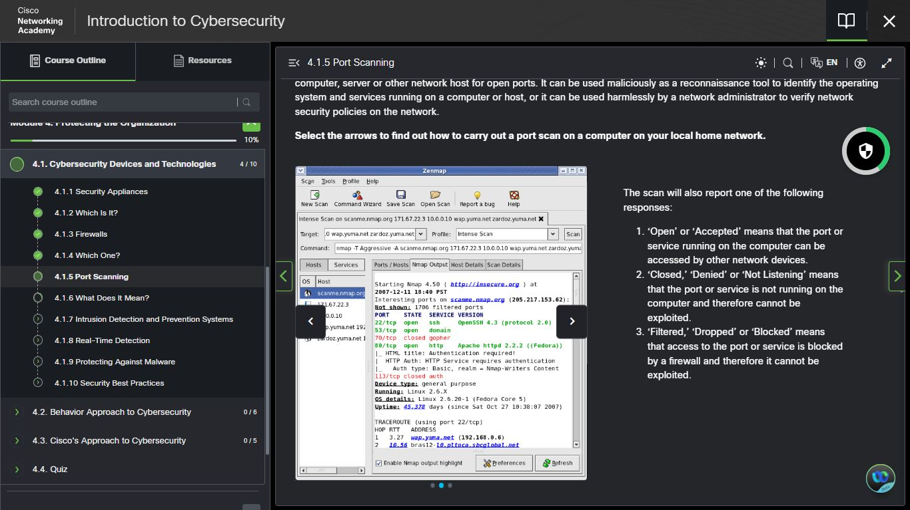

# Day 17 — Port Scanning | Nmap & Zenmap

**Date:** <!-- insert date -->
**Platform:** Cisco NetAcad — Module 4.1.5
**Topics:** Port Scanning | Nmap | Zenmap | 
Port States | Dual-Use Tools
**Note:** Nmap installation pending — network issues

---

## 🔍 Port Scanning — Core Concept

Every application running on a networked device is
assigned a **port number** used at both ends of a
transmission to direct data to the correct application.

**Port scanning** is the process of probing a computer,
server, or network host to identify open ports and
the services running on them.

---

## ⚔️ Dual-Use Nature of Port Scanning

| Context | User | Purpose |
|---------|------|---------|
| **Offensive** | Attacker | Reconnaissance — map open ports, identify exploitable services |
| **Defensive** | Administrator | Audit — verify security policies, close unnecessary ports |

> The same technique serves both attacker and defender.
> The difference is authorisation and intent.
> Understanding how attackers use port scanning is
> essential for knowing what to defend against.

---

## 🛠️ Nmap & Zenmap

**Nmap** — industry-standard open-source port scanning tool
**Zenmap** — the official GUI version of Nmap

### How a Scan Works
1. Enter the target IP address
2. Select a scanning profile
3. Press scan
4. Results report all open ports and services running

### Port Scan Response Types

| Response | Meaning | Security Implication |
|----------|---------|---------------------|
| **Open / Accepted** | Port accessible by other devices | Service is running and reachable |
| **Closed / Denied / Not Listening** | No service running on port | No immediate risk but port is visible |
| **Filtered / Dropped / Blocked** | Firewall blocking access | Port protected — attacker cannot determine status |

---

## 📸 Screenshots

### 📘 Cisco — Port Scanning 4.1.5 (Zenmap Demo)

### 🛠️ Nmap.org — Download Page

---

## 📌 Practical — Pending

Nmap/Zenmap installation was not completed today
due to network connectivity issues.

**Planned next steps once network is available:**
- Download and install Nmap/Zenmap
- Run a scan on local home network IP
- Observe and document open ports and services
- Identify any unexpected open ports

> Hands-on practice will be documented in a
> follow-up entry once connectivity is restored.

---

## 📊 Overall Progress

| Milestone | Status |
|-----------|--------|
| Module 1 | ✅ Complete |
| Module 2 | ✅ Complete |
| Module 3 | ✅ Complete |
| Module 4 | 🔄 In Progress |
| IBM SkillsBuild | ✅ Active |
| Days Completed | 17 / 180 |

---

## ✅ Summary
- Port scanning probes devices to identify
  open ports and running services
- Same technique — offensive recon vs
  defensive auditing — intent is the difference
- Nmap is the industry standard | Zenmap is its GUI
- Three port states: Open | Closed | Filtered
- Hands-on installation pending network access

---

*[← Day 16](day-16.md) | [Day 18 →](day-18.md)*
