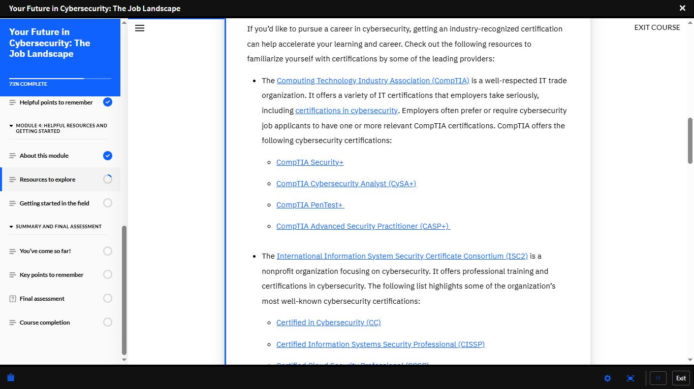
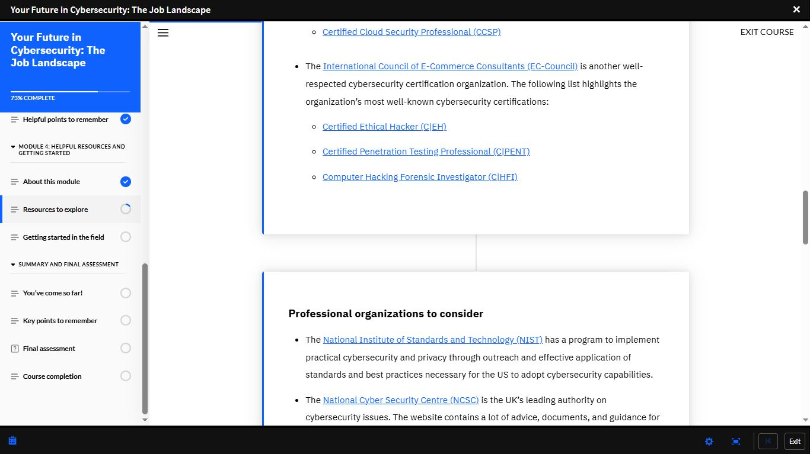
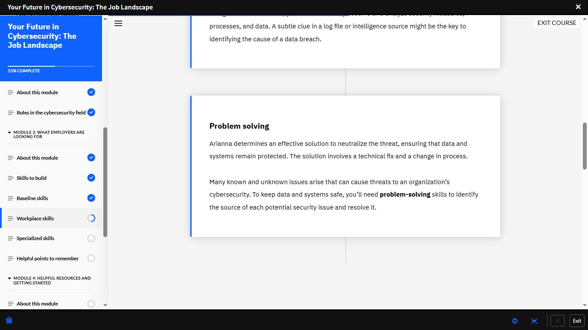
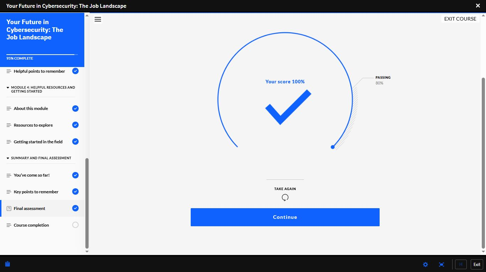
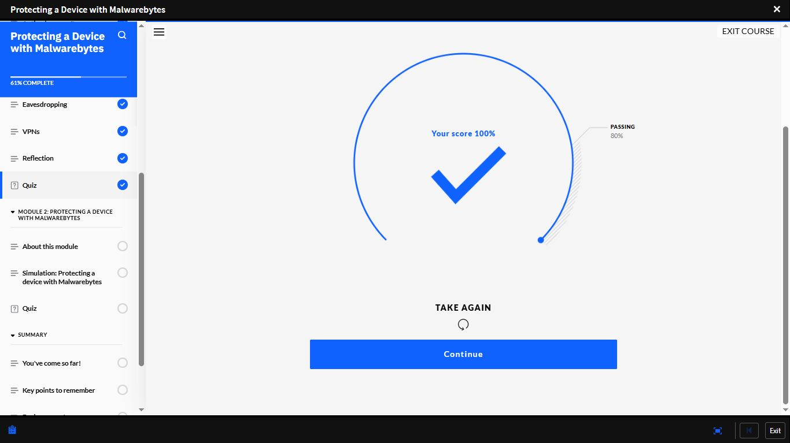
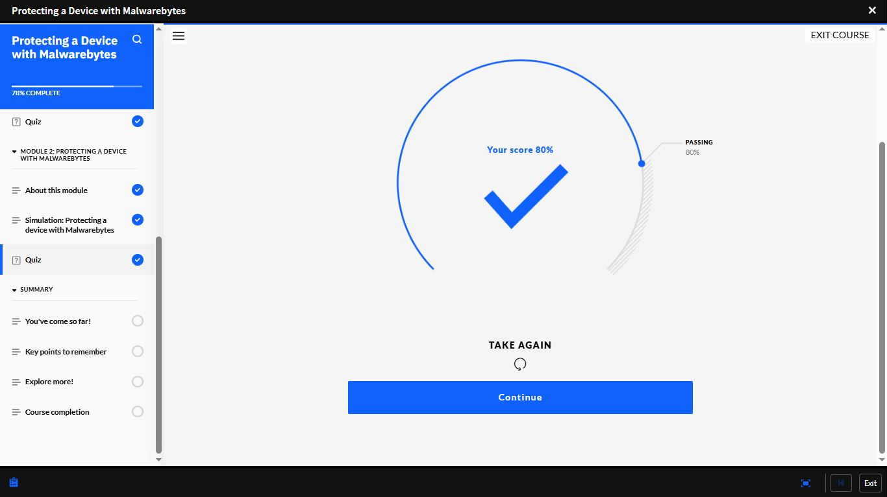
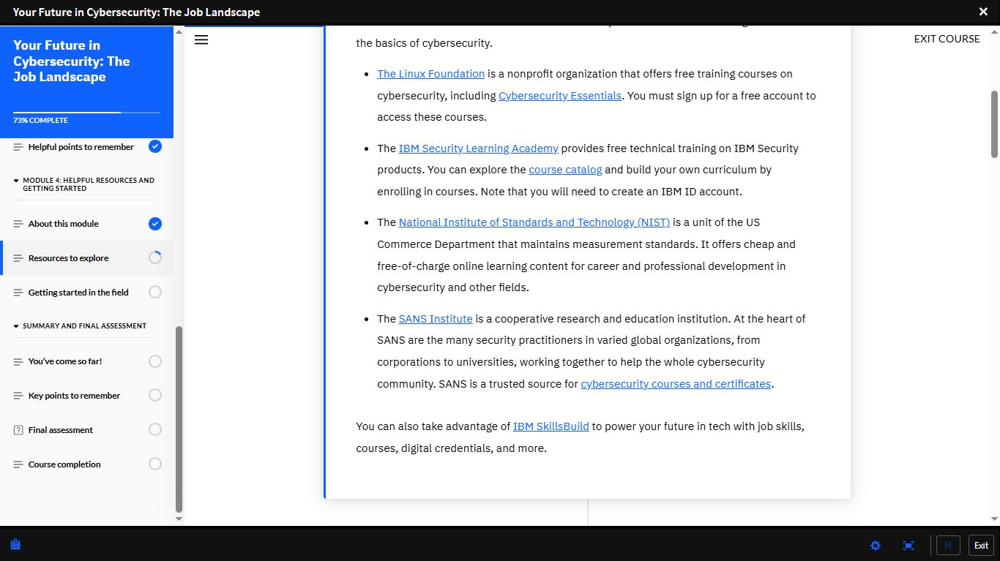

# Day 20 — IBM SkillsBuild: Job Landscape (100%) & Malwarebytes Course

**Date:** <!-- insert date -->
**Platform:** IBM SkillsBuild
**Courses:** Your Future in Cybersecurity: The Job Landscape |
Protecting a Device with Malwarebytes
**Milestone:** Job Landscape Final Assessment 100% ✅

---

## 📘 Course 1: Your Future in Cybersecurity — The Job Landscape

**Progress:** 95% → Final Assessment Complete
**Final Assessment Score:** 100% (Passing: 80%)

---

### 🏅 Industry Certifications

#### CompTIA
| Certification | Focus |
|--------------|-------|
| **Security+** | Entry-level security fundamentals |
| **CySA+** | Cybersecurity analyst skills |
| **PenTest+** | Penetration testing |
| **CASP+** | Advanced security practitioner |

#### ISC2
| Certification | Focus |
|--------------|-------|
| **CC** | Certified in Cybersecurity — entry level |
| **CISSP** | Senior security professional standard |
| **CCSP** | Cloud security specialist |

#### EC-Council
| Certification | Focus |
|--------------|-------|
| **CEH** | Certified Ethical Hacker |
| **C\|PENT** | Certified Penetration Testing Professional |
| **C\|HFI** | Computer Hacking Forensic Investigator |

---

### 📚 Free Learning Resources

| Resource | What It Offers |
|----------|---------------|
| **Linux Foundation** | Free cybersecurity training including Cybersecurity Essentials |
| **IBM Security Learning Academy** | Free technical training on IBM Security products |
| **NIST** | Free/cheap online learning for career development |
| **SANS Institute** | Trusted cybersecurity courses and certificates |
| **IBM SkillsBuild** | Job skills, courses, and digital credentials |

---

### 🏢 Professional Organisations

| Organisation | Focus |
|-------------|-------|
| **NIST** | Practical cybersecurity standards and best practices |
| **NCSC** | UK's leading cybersecurity authority — advice and guidance |
| **OWASP** | Worldwide nonprofit improving software security |
| **ISSA** | Information security profession community |
| **WiCyS** | Women in cybersecurity — networking and mentoring |
| **FIRST** | Global incident response forum and best practices |

---

### 💼 Skills Employers Are Looking For

#### Baseline Skills
Core technical foundations expected of all cybersecurity professionals.

#### Workplace Skills
Communication, collaboration, and professional conduct
in a security operations environment.

#### Problem Solving
> Many known and unknown issues arise that can cause
> threats to an organisation's cybersecurity.
> To keep data and systems safe, you need problem-solving
> skills to identify the source of each potential
> security issue and resolve it.

**Key insight:** Technical skill alone is not enough.
The ability to think clearly under pressure and
communicate findings to non-technical stakeholders
is equally valued by employers.

---

## 🛡️ Course 2: Protecting a Device with Malwarebytes

**Progress:** 78% Complete
**Module 1 Quiz:** 100% ✅
**Module 2 Quiz:** 80% ✅

### Topics Covered

#### Eavesdropping
Attackers intercepting network communications to
capture sensitive data in transit.

#### VPNs (Virtual Private Networks)
Encrypts all traffic between a device and the internet —
essential protection on public or untrusted networks.

#### Simulation: Protecting a Device with Malwarebytes
Hands-on simulation using Malwarebytes to protect
a device from malware — practical tool usage in
a guided environment.

---

## 📸 Screenshots

### 📘 IBM SkillsBuild — Job Landscape: Certifications

### 📘 IBM SkillsBuild — Job Landscape: EC-Council & Orgs

### 📘 IBM SkillsBuild — Job Landscape: OWASP, ISSA, WiCyS

### 📘 IBM SkillsBuild — Job Landscape: Problem Solving

### 🏆 IBM SkillsBuild — Job Landscape Final Assessment: 100%

### 🛡️ IBM SkillsBuild — Malwarebytes Module 1 Quiz: 100%

### 🛡️ IBM SkillsBuild — Malwarebytes Module 2 Quiz: 80%

### 📘 IBM SkillsBuild — Job Landscape: Free Resources

---

## 📊 Overall Progress

| Milestone | Status |
|-----------|--------|
| Cisco Module 1 | ✅ Complete |
| Cisco Module 2 | ✅ Complete |
| Cisco Module 3 | ✅ Complete |
| Cisco Module 4 | 🔄 In Progress |
| IBM SkillsBuild — Job Landscape | ✅ 95% — Final Assessment Done |
| IBM SkillsBuild — Malwarebytes | 🔄 78% In Progress |
| Days Completed | 20 / 180 |

---

## ✅ Summary
- Job Landscape final assessment: 100% —
  certifications, resources, and employer
  expectations fully mapped
- CompTIA, ISC2, EC-Council — three certification
  bodies every cybersecurity professional must know
- OWASP, NIST, NCSC, FIRST — professional
  organisations for continuous development
- Problem solving is a core employer requirement —
  not just a soft skill
- Malwarebytes course: Module 1 (100%) and
  Module 2 (80%) — simulation completed
- VPNs and eavesdropping covered — direct
  application to network security fundamentals

---

*[← Day 19](day-19.md) | [Day 21 →](day-21.md)*
