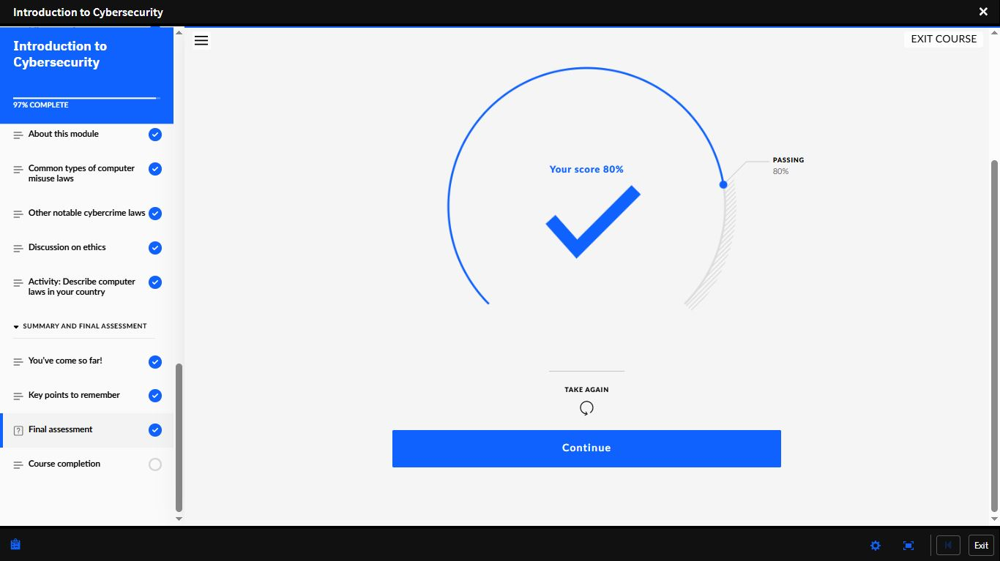
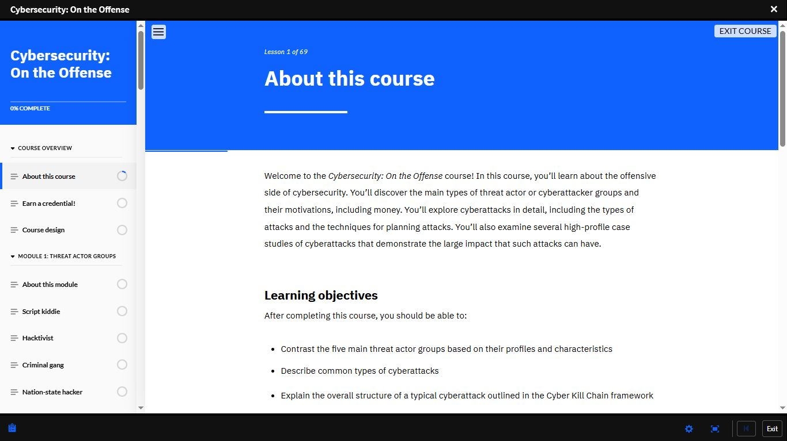

# Day 21 — IBM SkillsBuild: Intro to Cybersecurity Complete + Offensive Security

**Date:** <!-- 24/05/2026 -->
**Platform:** IBM SkillsBuild
**Courses:** Introduction to Cybersecurity (Complete) |
Cybersecurity: On the Offense (Started)
**Milestone:** Introduction to Cybersecurity — Final Assessment 80% ✅

---

## ⚖️ Course 1: Introduction to Cybersecurity — Complete

**Final Assessment Score:** 80% (Passing: 80%) ✅
**Progress:** 97% → Complete

### Topics Completed
- Common types of computer misuse laws
- Other notable cybercrime laws
- Discussion on ethics in cybersecurity
- Activity: Computer laws applicable in Nigeria

### Key Insight
> Understanding legal and ethical boundaries is not
> optional in cybersecurity.
> The same technical action — performed with or without
> authorisation — is the difference between a security
> professional and a criminal.

---

## ⚔️ Course 2: Cybersecurity: On the Offense

**Progress:** Started — Lesson 1 of 69
**Structure:** Module 1: Threat Actor Groups | Attack
Techniques | AI in Cybersecurity | Frameworks

---

## 🎭 Threat Actor Groups

| Actor | Motivation | Skill Level | Key Characteristic |
|-------|-----------|-------------|-------------------|
| **Script Kiddie** | Notoriety, disruption | Low | Uses pre-made tools, no original capability |
| **Hacktivist** | Ideology, political cause | Variable | Targets organisations that conflict with their beliefs |
| **Criminal Gang** | Financial gain | Medium-High | Organised, persistent, profit-driven |
| **Nation-State Hacker** | Geopolitical objectives | Very High | Government-backed, most sophisticated threat actor |
| **Offensive Security Researcher** | Discovery, improvement | High | Authorised — finds vulnerabilities ethically |

> Nation-state hackers represent the most dangerous
> category — unlimited resources, government backing,
> and long-term strategic objectives.

---

## 💀 Attack Techniques

### Man-in-the-Middle (MitM)
An attacker secretly intercepts and potentially alters
communications between two parties who believe they
are communicating directly with each other.

**Common scenarios:**
- Public Wi-Fi interception
- ARP poisoning on local networks
- SSL stripping to downgrade HTTPS to HTTP

### Spear Phishing
A highly targeted form of phishing using personal
information about the victim to increase credibility
and the likelihood of success.

| Phishing | Spear Phishing |
|----------|---------------|
| Mass, generic | Targeted, personalised |
| Low success rate | Significantly higher success rate |
| No research required | Requires prior reconnaissance |

### DNS Attack
Manipulating DNS resolution to redirect users to
malicious servers or intercept DNS queries.

**Types:**
- DNS Poisoning — corrupting DNS cache
- DNS Hijacking — redirecting DNS queries
- DNS Tunnelling — exfiltrating data via DNS traffic

### SQL Injection
Inserting malicious SQL code into input fields to
manipulate database queries — extracting, modifying,
or deleting data without authorisation.

```sql
-- Example of vulnerable query
SELECT * FROM users WHERE username = '' OR '1'='1';
-- Returns all users — authentication bypassed
```

> SQL Injection remains one of the most common and
> dangerous web application vulnerabilities —
> listed in the OWASP Top 10 consistently.

---

## 🤖 AI in Cybersecurity — Offensive Applications

AI is no longer just a defensive tool. Attackers are
actively leveraging it across four key areas:

| AI Application | Offensive Use |
|---------------|--------------|
| **Task Automation** | Automate scanning, exploitation, and data exfiltration at scale |
| **Detection Evasion** | Generate malware variants that bypass signature-based detection |
| **Target Identification** | Analyse vast datasets to identify high-value targets and vulnerabilities |
| **Social Engineering** | Generate hyper-personalised phishing content using victim data |

> The same AI tools used in defence are being
> weaponised for attack.
> This is the arms race cybersecurity professionals
> are operating in right now.

---

## 🔗 Industry Frameworks

### Lockheed Martin Cyber Kill Chain

A 7-stage model mapping the full lifecycle of a
cyberattack — from initial reconnaissance to
final objective completion.

Stage 1 → Reconnaissance      — gathering target information
Stage 2 → Weaponisation       — creating the attack payload
Stage 3 → Delivery            — transmitting the payload
Stage 4 → Exploitation        — triggering the vulnerability
Stage 5 → Installation        — establishing persistence
Stage 6 → Command & Control   — attacker communicates with malware
Stage 7 → Actions on Objectives — data theft, destruction, ransomware

> Understanding which kill chain stage an attacker
> is in determines the appropriate defensive response.
> Early detection = fewer stages completed =
> less damage done.

### MITRE ATT&CK Matrix

A globally accessible, continuously updated knowledge
base of adversary tactics and techniques based on
real-world attack observations.

| Component | Description |
|-----------|-------------|
| **Tactics** | The attacker's goal at each stage (why) |
| **Techniques** | How the attacker achieves that goal (how) |
| **Sub-techniques** | Specific variations of each technique |
| **Procedures** | Real-world examples from known threat actors |

> MITRE ATT&CK is the most comprehensive reference
> available for understanding how attacks actually
> happen in practice — not in theory.
> Used by SOC Analysts, threat hunters, and red teams
> globally as a common language for describing attacks.

---

## 📸 Screenshots

### ⚖️ IBM SkillsBuild — Intro to Cybersecurity Final Assessment: 80%


### ⚔️ IBM SkillsBuild — Cybersecurity: On the Offense (Started)


---

## 📊 Overall Progress

| Milestone | Status |
|-----------|--------|
| Cisco Module 1 | ✅ Complete |
| Cisco Module 2 | ✅ Complete |
| Cisco Module 3 | ✅ Complete |
| Cisco Module 4 | 🔄 In Progress |
| IBM — Job Landscape | ✅ Complete (100%) |
| IBM — Intro to Cybersecurity | ✅ Complete (80%) |
| IBM — Malwarebytes | 🔄 78% |
| IBM — Cybersecurity: On the Offense | 🔄 Started |
| Days Completed | 21 / 180 |

---

## ✅ Summary
- Computer misuse laws and ethics completed —
  legal boundaries are as important as technical ones
- 5 threat actor groups mapped — script kiddie
  through nation-state hacker
- MitM, Spear Phishing, DNS attacks, SQL Injection
  — offensive techniques understood from
  attacker perspective
- AI now used offensively for automation,
  evasion, targeting, and social engineering
- Cyber Kill Chain — 7 stages from recon
  to objective completion
- MITRE ATT&CK — tactics, techniques,
  sub-techniques, and real-world procedures

---

*[← Day 20](day-20.md) | [Day 22 →](day-22.md)*
