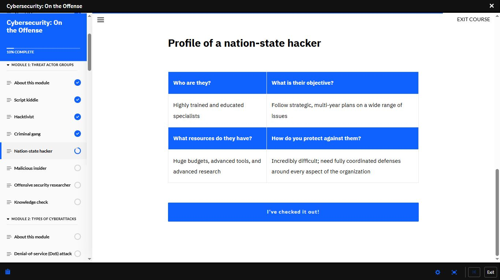
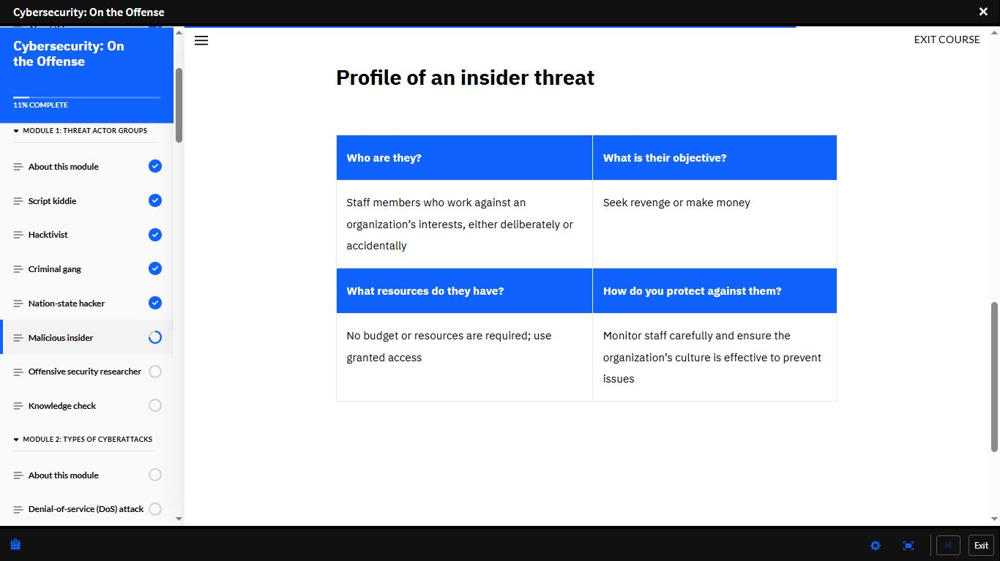
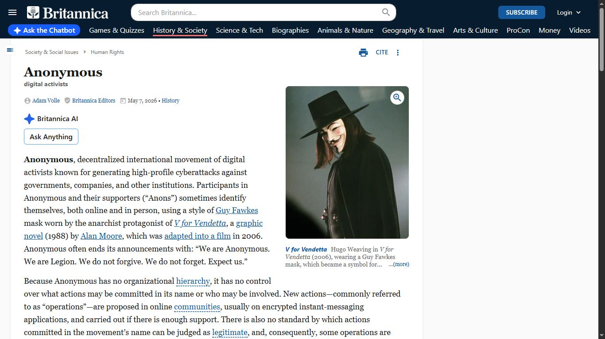
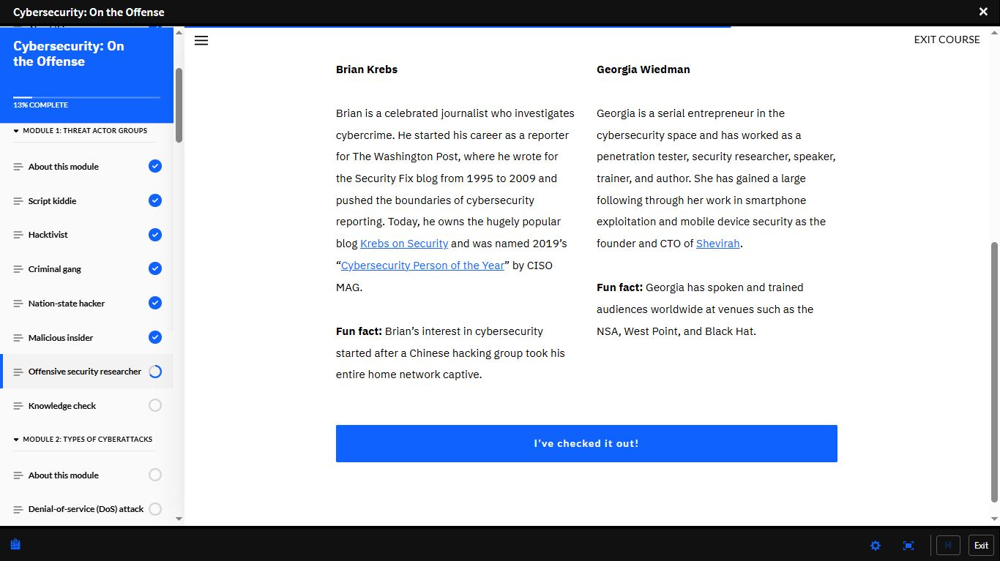
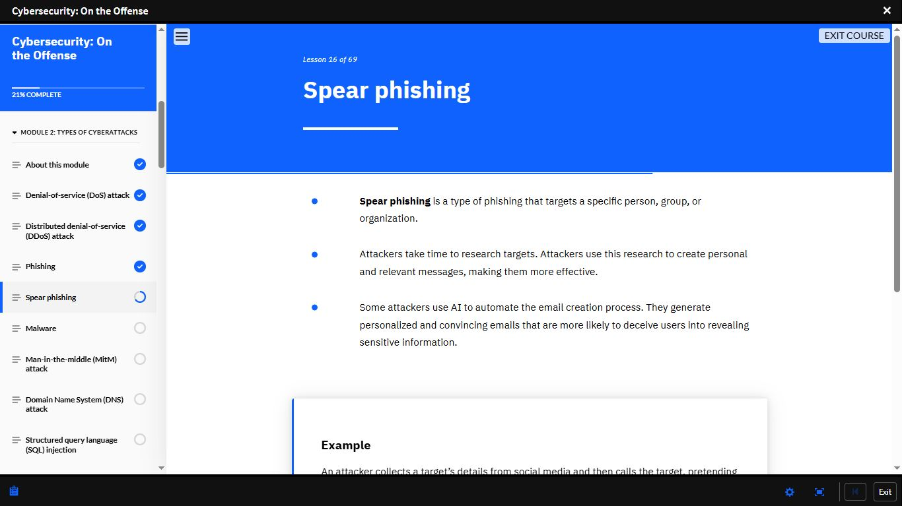
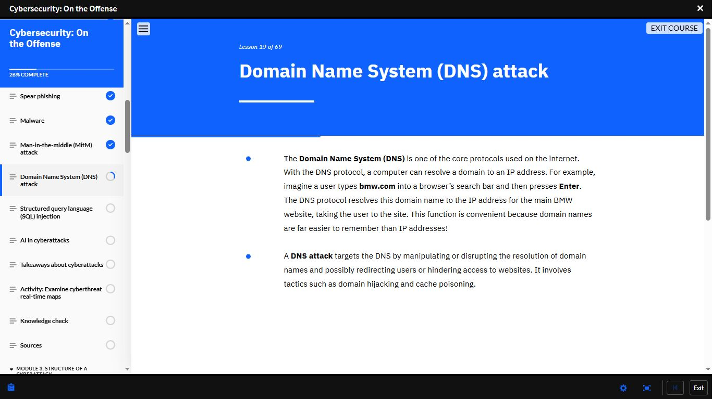
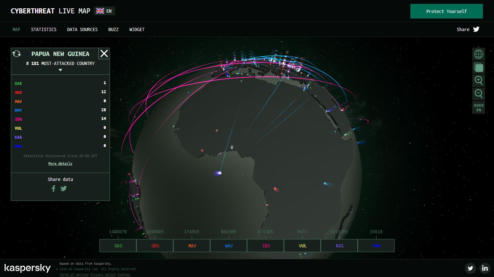
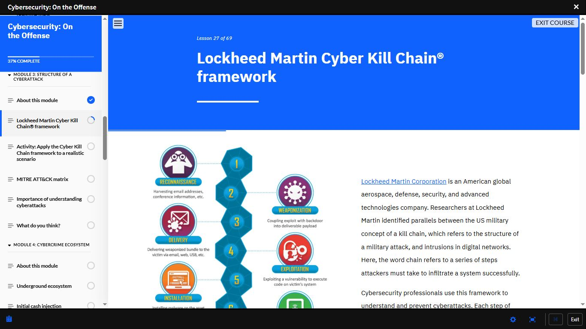

# Day 22 — Cybersecurity: On the Offense | Threat Actors, Attacks & Kill Chain

**Date:** <!-- 25/05/2026 -->
**Platform:** IBM SkillsBuild — Cybersecurity: On the Offense
**Progress:** 37% Complete (Lesson 27 of 69)
**Modules Covered:** Module 1: Threat Actor Groups |
Module 2: Types of Cyberattacks |
Module 3: Structure of a Cyberattack (started)

---

## 🎭 Module 1: Threat Actor Groups — Completed

### Full Threat Actor Profile Table

| Actor | Who They Are | Objective | Resources | Defence |
|-------|-------------|-----------|-----------|---------|
| **Script Kiddie** | Low-skill, uses pre-made tools | Disruption, notoriety | Minimal | Patch systems, monitor noise |
| **Hacktivist** | Ideologically motivated | Political/social cause | Variable | Monitor public sentiment, secure public-facing assets |
| **Criminal Gang** | Organised, financially driven | Money | Medium-High | Layered security, incident response |
| **Nation-State Hacker** | Government-backed specialists | Strategic multi-year objectives | Huge budgets, advanced tools | Fully coordinated organisational defence |
| **Malicious Insider** | Staff working against the org | Revenge or financial gain | Granted access — no budget needed | Staff monitoring, strong security culture |
| **Offensive Security Researcher** | Ethical, authorised | Find vulnerabilities before attackers | Professional tools | N/A — they are the defence |

---

### 🎭 Hacktivist — Real World Example: Anonymous

> "We are Anonymous. We are Legion.
> We do not forgive. We do not forget. Expect us."

- Decentralised international movement of digital activists
- Targets governments, companies, and institutions
- No hierarchy — no control over actions committed in their name
- Operations proposed via encrypted messaging apps
- Uses Guy Fawkes mask as symbol — from *V for Vendetta* (1988/2006)

---

### 🔬 Offensive Security Researchers — Notable Figures

| Person | Background | Known For |
|--------|-----------|-----------|
| **Brian Krebs** | Journalist, Washington Post | Krebs on Security blog — Cybersecurity Person of the Year 2019 (CISO MAG). His interest in cybersecurity started after a Chinese hacking group took his entire home network captive. |
| **Georgia Wiedman** | Penetration tester, researcher, author | Founder & CTO of Shevirah. Specialises in smartphone exploitation and mobile device security. Has trained at NSA, West Point, and Black Hat. |

---

### 🕵️ Malicious Insider — Profile

| | Detail |
|-|--------|
| **Who** | Staff members working against organisational interests — deliberately or accidentally |
| **Objective** | Seek revenge or make money |
| **Resources** | No budget required — uses existing granted access |
| **Defence** | Monitor staff carefully | Build effective organisational security culture |

---

### 🌐 Nation-State Hacker — Profile

| | Detail |
|-|--------|
| **Who** | Highly trained, educated specialists |
| **Objective** | Strategic, multi-year plans across a wide range of issues |
| **Resources** | Huge budgets, advanced tools, advanced research |
| **Defence** | Incredibly difficult — requires fully coordinated defences around every aspect of the organisation |

---

## 💀 Module 2: Types of Cyberattacks

### Spear Phishing — Lesson 16

| | Phishing | Spear Phishing |
|-|----------|---------------|
| **Target** | Mass, generic | Specific person, group, or organisation |
| **Research** | None | Extensive — social media, public records |
| **Effectiveness** | Lower | Significantly higher |
| **AI involvement** | Rare | Attackers now use AI to automate personalised email generation at scale |

> Attackers research targets and use that information
> to craft personal, relevant messages.
> AI now automates this process — generating convincing
> emails that are harder to identify as malicious.

### DNS Attack — Lesson 19

DNS is one of the core protocols of the internet —
translating domain names to IP addresses.

**A DNS attack** manipulates or disrupts this resolution:

| Technique | Method |
|-----------|--------|
| **Domain Hijacking** | Redirects users to attacker-controlled servers |
| **Cache Poisoning** | Corrupts DNS cache with false entries |

> Example: A user types `bmw.com` — a DNS attack
> could redirect that request to a malicious site
> that looks identical to the real one.

---

## 🗺️ Activity: Kaspersky Cyberthreat Live Map

Explored the Kaspersky real-time global cyberattack
map as part of the course activity.

**Observed on the live map:**

| Category | Count (Papua New Guinea panel) |
|----------|-------------------------------|
| OAS (On-Access Scan) | 1 |
| ODS (On-Demand Scan) | 12 |
| WAV (Web Anti-Virus) | 28 |
| IDS (Intrusion Detection) | 14 |

**Global totals visible at time of capture:**
- OAS: 1,488,870
- ODS: 3,190,485
- MAV: 174,965
- WAV: 866,309
- IDS: 671,305

> Watching live attacks flow across the globe in
> real time makes the threat landscape viscerally
> real in a way no textbook can replicate.
> These are not simulated numbers — they are
> live detections happening continuously.

---

## 🔗 Module 3: Structure of a Cyberattack

### Lockheed Martin Cyber Kill Chain® — Lesson 27

Developed by Lockheed Martin — drawing parallels
between US military kill chain doctrine and
intrusions in digital networks.

Stage 1 → RECONNAISSANCE
Harvesting email addresses, conference info,
public data about the target
Stage 2 → WEAPONISATION
Coupling an exploit with a backdoor into
a deliverable payload
Stage 3 → DELIVERY
Delivering the weaponised bundle via
email, web, USB, or other vector
Stage 4 → EXPLOITATION
Exploiting a vulnerability to execute
code on the victim's system
Stage 5 → INSTALLATION
Installing malware on the compromised asset
Stage 6 → COMMAND & CONTROL (C2)
Attacker establishes remote control channel
Stage 7 → ACTIONS ON OBJECTIVES
Data theft, destruction, ransomware,
lateral movement

> Each stage must be completed for an attack to succeed.
> Disrupting **any single stage** breaks the kill chain.
> Early disruption = less damage.
> A SOC Analyst uses the Kill Chain to determine
> exactly where in an attack they are — and
> what response is appropriate at that stage.

**Next:** Activity — Apply the Kill Chain to a
realistic scenario | MITRE ATT&CK Matrix

---

## 📸 Screenshots

### 🎭 IBM — Nation-State Hacker Profile

### 🕵️ IBM — Malicious Insider Profile

### 🎭 IBM — Hacktivist: Anonymous (Britannica)

### 🔬 IBM — Offensive Security Researchers

### 🎣 IBM — Spear Phishing

### 🌐 IBM — DNS Attack

### 🗺️ Kaspersky — Cyberthreat Live Map

### 🔗 IBM — Lockheed Martin Cyber Kill Chain®

---

## 📊 Overall Progress

| Milestone | Status |
|-----------|--------|
| Cisco Module 1–3 | ✅ Complete |
| Cisco Module 4 | 🔄 In Progress |
| IBM — Job Landscape | ✅ Complete (100%) |
| IBM — Intro to Cybersecurity | ✅ Complete (80%) |
| IBM — Malwarebytes | 🔄 78% |
| IBM — Cybersecurity: On the Offense | 🔄 37% |
| Days Completed | 22 / 180 |

---

## ✅ Summary
- Full threat actor profiles completed — Script Kiddie
  through Offensive Security Researcher
- Malicious Insider requires no external resources —
  uses existing access, making detection harder
- Nation-State Hackers require fully coordinated
  organisational defence — most dangerous actor type
- Anonymous studied as real-world hacktivist example
- Brian Krebs and Georgia Wiedman — notable ethical
  security researchers
- Spear Phishing now AI-automated — personalised
  at scale
- DNS attacks manipulate resolution via hijacking
  and cache poisoning
- Kaspersky Live Map — millions of real-time
  global detections observed
- Cyber Kill Chain: 7 stages — disrupting any one
  stage breaks the attack

---

*[← Day 21](day-21.md) | [Day 23 →](day-23.md)*
