# Day 23 — IBM SkillsBuild: Cybercrime Ecosystem, OSINT, Technical Scanning & Case Studies

**Date:** <!-- insert date -->
**Platform:** IBM SkillsBuild — Cybersecurity: On the Offense
**Progress:** 37% → 86% (Lesson 60 of 69)
**Modules Covered:** Module 4: Cybercrime Ecosystem |
Module 5: Social Engineering | Module 6: OSINT |
Module 7: Technical Scanning | Module 8: Case Studies (started)

---

## 💰 Module 4: Cybercrime Ecosystem

### Underground Economy Structure
Cybercrime operates as an organised underground
economy with defined roles and financial flows.

### Initial Cash Injection
Funding required to launch criminal cyber operations —
purchasing tools, infrastructure, and access.

### Cryptocurrency — The Preferred Currency of Cybercrime

**Cryptocurrency** is a digital/virtual currency using
cryptography to secure financial transactions and
verify asset transfers. Each cryptocurrency has its
own rules but all operate on **blockchain** technology.

| Feature | Why Criminals Prefer It |
|---------|------------------------|
| **Blockchain** | Distributed ledger — permanent, transparent, difficult to alter |
| **Pseudonymity** | Transactions not directly linked to real identities |
| **Irreversibility** | Once sent, cannot be reversed by a third party |
| **Global** | No borders, no banks, no intermediaries |

> Bitcoin, introduced in 2009, paved the way for
> the cryptocurrency ecosystem that now underpins
> ransomware payment demands globally.

---

## 🧠 Module 5: Social Engineering

### Definition
> Social engineering is the use of deception to
> manipulate individuals into divulging confidential
> or personal information for fraudulent purposes.
> It overlaps with psychology, biology, and mathematics.

### How It Works
- Can be executed in person, by phone, or online
- Focuses on exploiting human behaviour rather
  than technical vulnerabilities
- When successful: attacker gains system access,
  steals assets, or advances a more complex attack

### Key Aspects of a Social Engineering Attack
- Research and targeting
- Building trust or creating urgency
- Executing the manipulation
- Exploiting the gained access

### Defence
- Security awareness training
- Verify identity before sharing information
- Question urgency — pressure is a manipulation tactic

---

## 🔍 Module 6: Open-Source Intelligence (OSINT)

**OSINT** is intelligence gathered from publicly
available sources without hacking or active
collection methods.

### Sources of Open Information
- Blogs and news sites
- Public websites and databases
- Social media
- Public government records

### Who Uses It?

| User | Purpose |
|------|---------|
| **Journalists** | Investigative research |
| **Researchers** | Academic study |
| **Attackers** | Reconnaissance — map targets before striking |
| **Defenders** | Understand own exposure — close information gaps |

> Anyone with reliable internet access can
> conduct OSINT. The same information serves
> both attacker and defender.

---

## 🛠️ Module 7: Technical Scanning

Technical scanning techniques used during the
**Reconnaissance** stage of the Cyber Kill Chain.

---

### Ping Test — Lesson 51

Measures the time for a packet to travel from
one device to another using ICMP.

```bash
ping 192.168.0.1
```

| Packet Type | Direction | Meaning |
|-------------|-----------|---------|
| **Echo Request** | Outbound | "Are you there?" |
| **Echo Reply** | Inbound | "Yes, I'm here." |
| **No Reply** | — | Device unresponsive or address not allocated |

---

### Traceroute — Lesson 52

Maps the path packets take to a destination
using Time-To-Live (TTL) values.

```bash
traceroute target.com
```

**How it works:**
- Each packet has a TTL value
- TTL decreases by 1 at each router hop
- When TTL reaches 0, router returns error message
- This error reveals the router's location

**Attack value:** Reveals network topology —
intermediate routers and their IP addresses
— useful intelligence for planning attack routes.

---

### Port Scanning — Lesson 53

Identifies open ports and running services on a host.

> IP address = building
> Port number = floor within that building
> Port scanning = finding which floors have unlocked doors

**Nmap** (Network Mapper) — the most widely used
port scanner. Free, open-source, available on
Windows, macOS, and Linux.

---

### Vulnerability Scanning — Lesson 54

Proactively identifies exploitable weaknesses
in a system.

**Dynamic scanning** simulates hacking techniques
such as SQL injection to discover vulnerabilities
before or during an attack.

| Used By | Purpose |
|---------|---------|
| **Attacker** | Find exploitable entry points |
| **Defender** | Audit and remediate before attack |

---

### Shodan — Lesson 55

> "The world's first search engine for
> internet-connected devices."

Indexes billions of scan records across:
- Servers and workstations
- Power plants and industrial systems
- Mobile phones
- Refrigerators, smart devices
- Minecraft servers

**Dual use:**
- **Attackers:** Identify exposed targets at scale
- **Researchers:** Monitor internet exposure of assets

---

### AI in Technical Scanning — Lesson 57

ML algorithms enhance network scanning capabilities:

| AI Capability | Benefit |
|--------------|---------|
| **Independent analysis** | Categorises vulnerabilities without human input |
| **Severity prioritisation** | Ranks findings by risk level automatically |
| **Pattern learning** | Learns from past scans to anticipate future threats |
| **Process streamlining** | Reduces scanning time and human error at scale |

---

## 📁 Module 8: Case Studies

### Stuxnet — Lesson 60

**Year:** 2010
**Type:** Nation-state cyberweapon
**Target:** Iranian uranium processing centrifuges

> When Stuxnet was identified in 2010, it was one
> of the most advanced and targeted malware
> collections ever observed in the security community.

| Detail | Description |
|--------|-------------|
| **Target** | Industrial control systems (ICS) |
| **Method** | Modified centrifuge settings to cause physical damage |
| **Objective** | Sabotage Iranian nuclear weapons programme |
| **Significance** | First known cyberweapon to cause physical destruction |

---

### Los Angeles Unified School District (LAUSD) — Lesson 61

**Year:** 2022
**Type:** Ransomware attack
**Attacker:** Vice Society — Russian criminal gang

| Detail | Description |
|--------|-------------|
| **Scale** | 1,000+ schools | 600,000+ students |
| **Data Compromised** | SSNs, login credentials, tax forms, legal documents, financial reports, health info, student psychological assessments |
| **Response** | Refused to pay ransom |
| **Outcome** | Vice Society released data on dark web |

> LAUSD followed cybersecurity expert and law
> enforcement guidance — do not pay ransoms.
> The data was released regardless.
> This case demonstrates that paying does not
> guarantee data recovery or destruction.

**Coming next:** NSA, Cash App, SolarWinds case studies

---

## 📸 Screenshots

### 💰 Cryptocurrency — Module 4
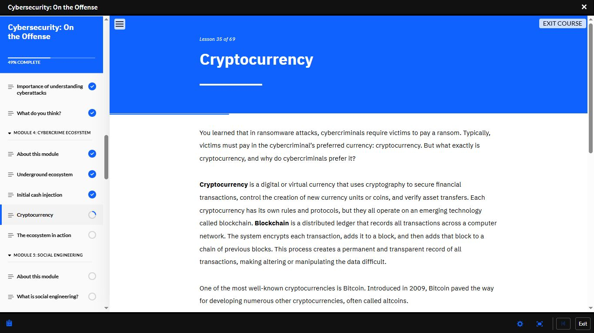

### 🧠 Social Engineering — Module 5
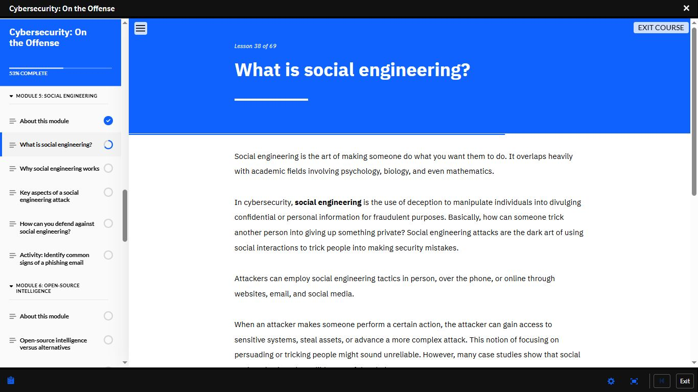

### 🔍 OSINT — Module 6
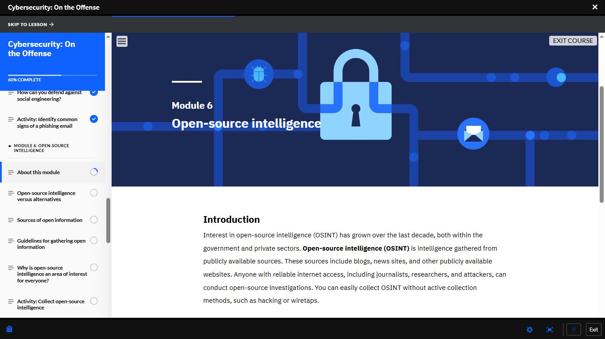

### 🛠️ Technical Scanning — Module 7
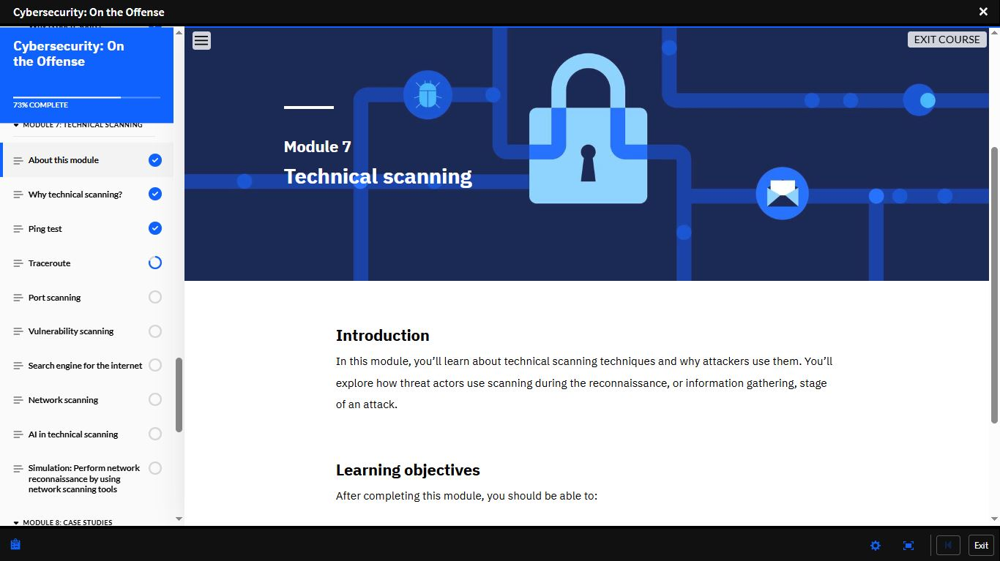

### 🔔 Ping Test
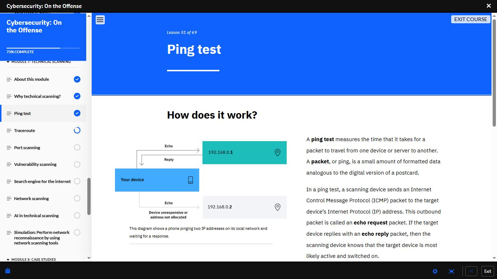

### 🗺️ Traceroute
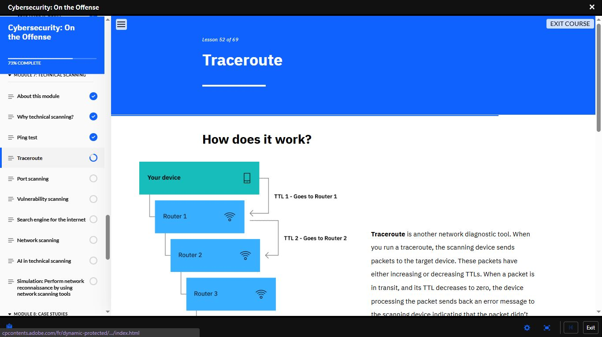

### 🚪 Port Scanning
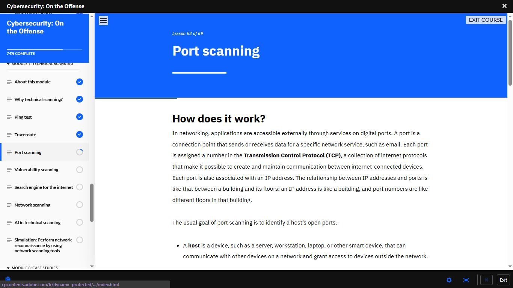

### 🔎 Vulnerability Scanning
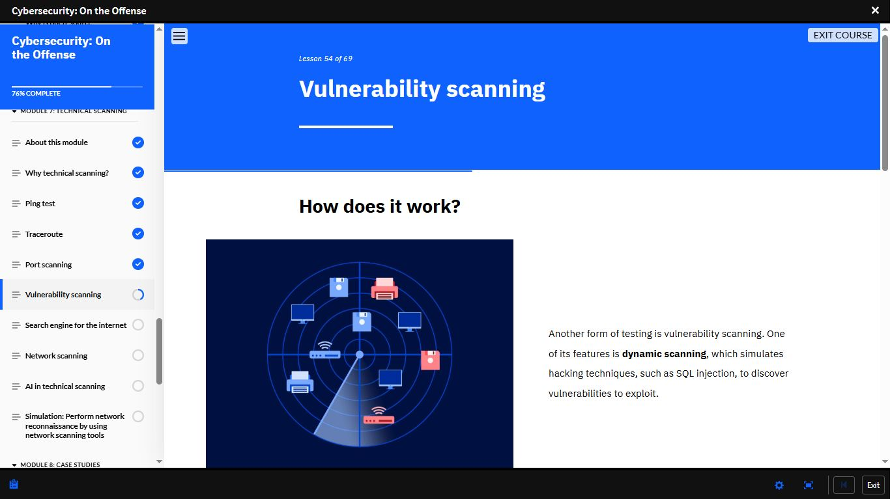

### 🌐 Shodan — Search Engine for the Internet
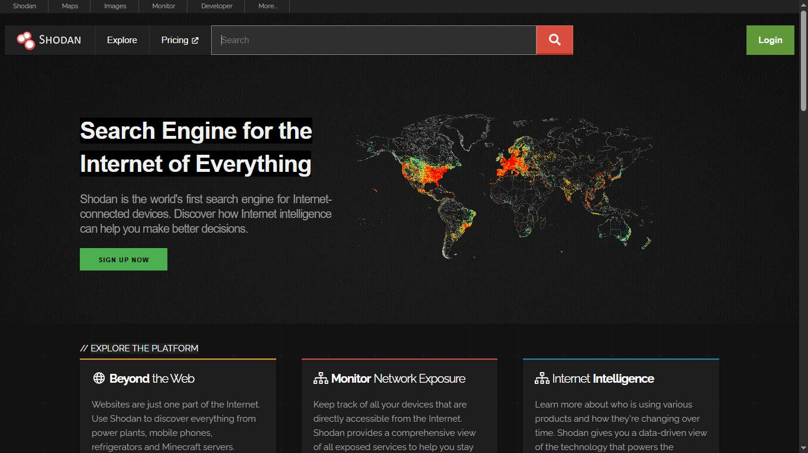

### 🌐 Search Engine for the Internet
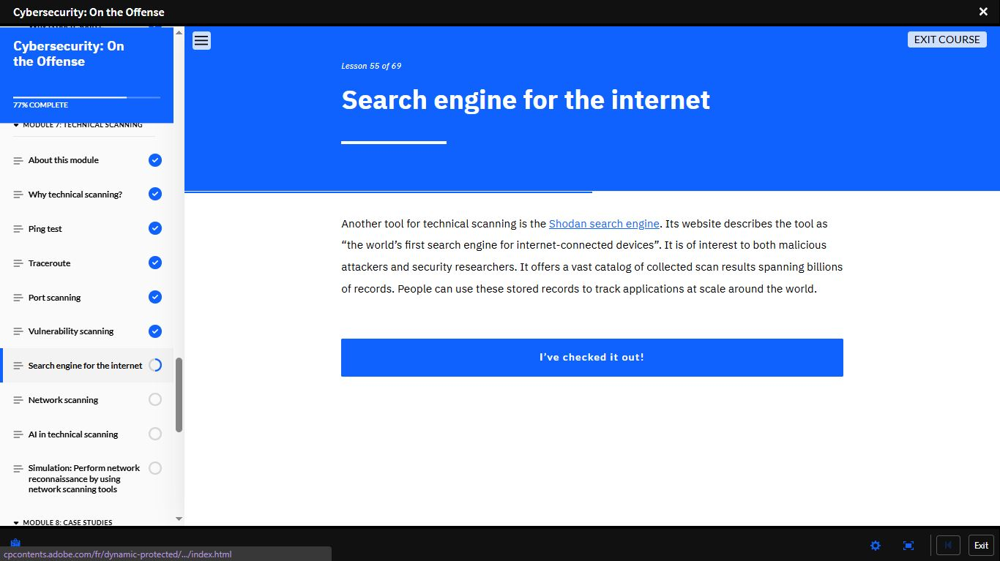

### 🤖 AI in Technical Scanning
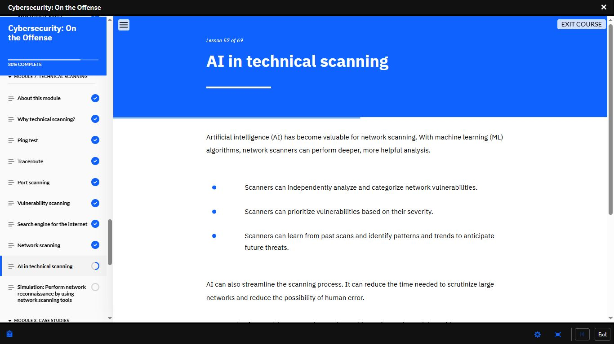

### 📁 Case Studies — Module 8
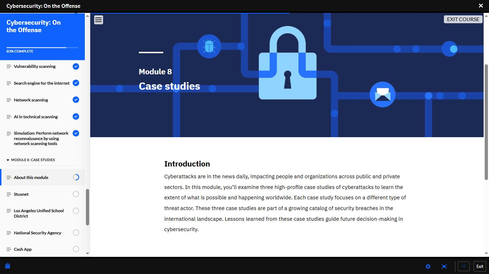

### 💣 Stuxnet
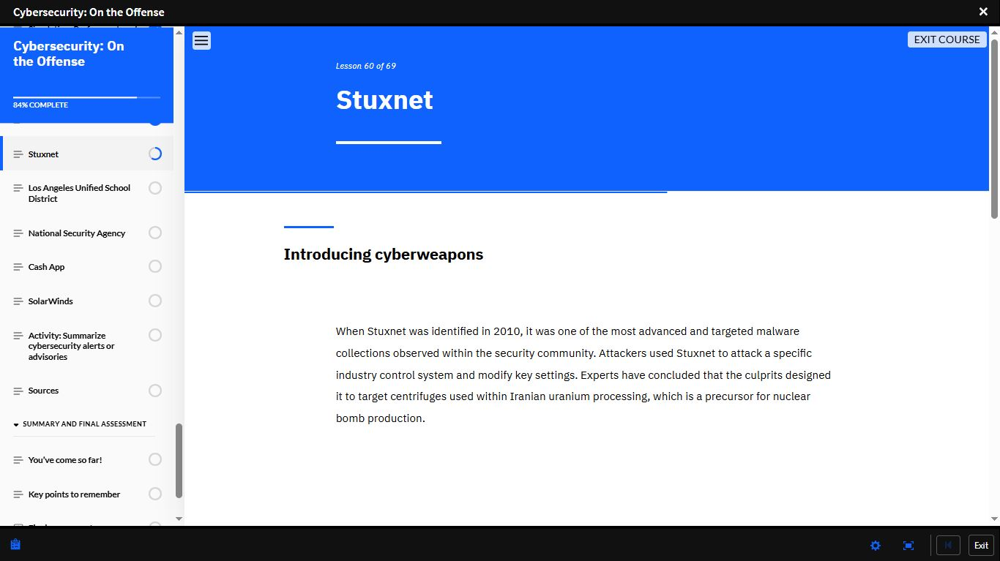

### 🏫 Los Angeles Unified School District
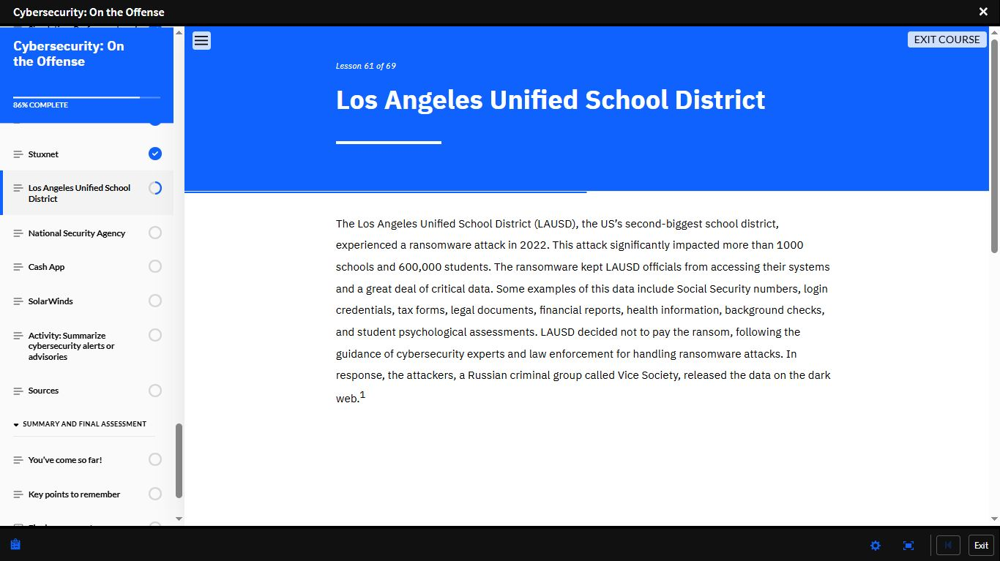

### Quiz
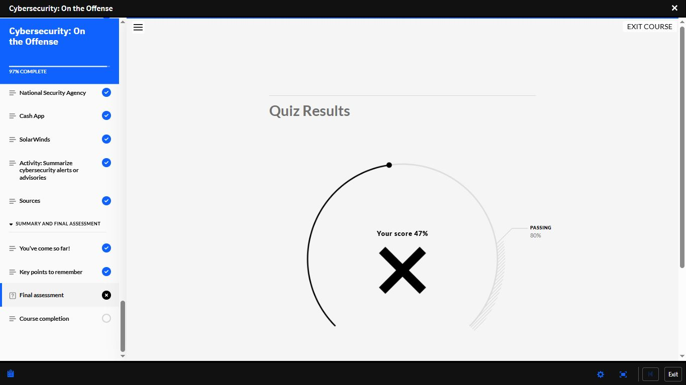

---

## 📊 Overall Progress

| Milestone | Status |
|-----------|--------|
| Cisco Module 1–3 | ✅ Complete |
| Cisco Module 4 | 🔄 In Progress |
| IBM — Job Landscape | ✅ Complete (100%) |
| IBM — Intro to Cybersecurity | ✅ Complete (80%) |
| IBM — Malwarebytes | 🔄 78% |
| IBM — On the Offense | 🔄 86% |
| Days Completed | 23 / 180 |

---

## ⚠️ Final Assessment Result

**Score: 47% — Failed**
**Passing threshold: 80%**

| Result | Detail |
|--------|--------|
| Score | 47% |
| Required | 80% |
| Status | ❌ Failed — Retake required |

> Honest documentation means recording failures
> as clearly as successes.
> 47% identifies a significant knowledge gap across
> the course material — particularly in modules
> covering technical scanning, OSINT, and case study
> analysis.
>
> Action: Full review of all modules before retake.
> The goal is mastery, not just a passing score.

---

## 🔔 Practical Reference — Ping Test (Day 19)

Ping test concepts covered in this module were
previously executed hands-on on Day 19:

```bash
ping 8.8.8.8       # Google DNS — 4/4 packets received, 0% loss
ping 192.0.2.1     # Reserved non-routable IP — 100% packet loss
```

Theory studied today directly maps to practical
output already executed on a real machine.
See [Day 19](day-19.md) for full results.

---

## ✅ Summary
- Cybercrime operates as an underground economy —
  cryptocurrency (blockchain) enables untraceable
  ransomware payments
- Social engineering exploits human psychology —
  not technical systems
- OSINT gathers intelligence from public sources —
  same data serves both attackers and defenders
- Technical scanning toolkit: Ping → Traceroute →
  Port Scanning → Vulnerability Scanning → Shodan
- AI in scanning: independent analysis, severity
  prioritisation, pattern learning
- Stuxnet — first cyberweapon causing physical
  destruction. LAUSD — 600k students affected,
  data released despite non-payment

---

*[← Day 22](day-22.md) | [Day 24 →](day-24.md)*
