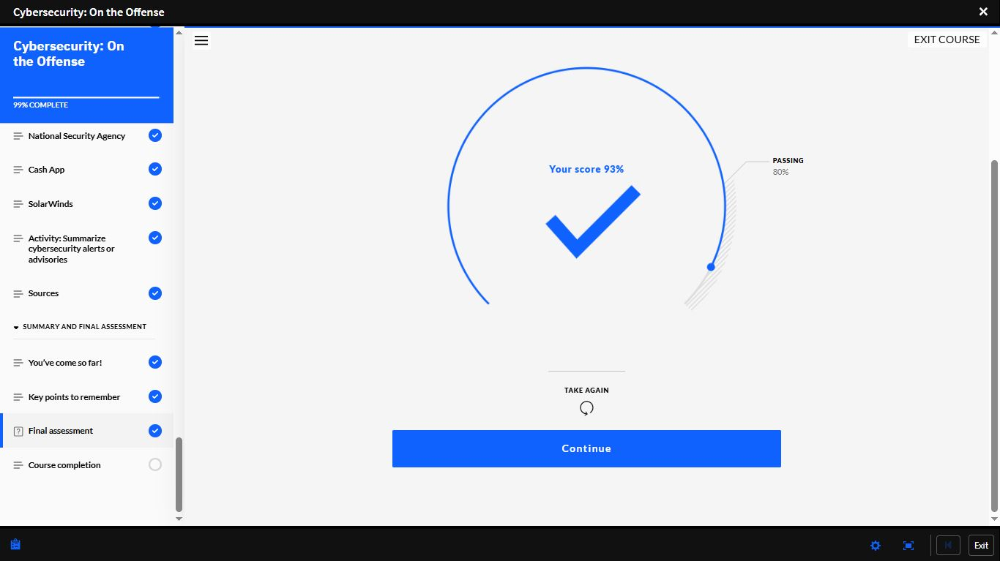

# Day 24 — Cybersecurity: On the Offense | Course Complete

**Date:** <!-- insert date -->
**Platform:** IBM SkillsBuild — Cybersecurity: On the Offense
**Progress:** 99% → Complete
**Milestone:** Final Assessment Retake — 93% ✅

---

## 📊 Final Assessment — Retake Result

| Attempt | Score | Status |
|---------|-------|--------|
| Attempt 1 (Day 23) | 47% | ❌ Failed |
| **Attempt 2 (Day 24)** | **93%** | **✅ Passed** |
| Passing Threshold | 80% | — |

> The difference between 47% and 93% is not luck.
> It is what happens when you identify your gaps,
> go back through the material deliberately,
> and rebuild understanding before attempting again.
> Moving on without mastery is not progress —
> it is debt that compounds later.

---

## 📁 Module 8: Case Studies — Completed

### National Security Agency (NSA)
Studied as a case study in the context of
cybersecurity operations and intelligence gathering
at a nation-state level.

### Cash App
Case study covering a data breach involving
a former employee — a real-world example of
the malicious insider threat actor profile
studied in Module 1.

### SolarWinds
One of the most significant supply chain attacks
in cybersecurity history. Attackers compromised
SolarWinds' Orion software update mechanism,
distributing malware to thousands of organisations
including multiple US government agencies.

| Detail | Description |
|--------|-------------|
| **Attack Type** | Supply chain compromise |
| **Method** | Malicious code injected into legitimate software update |
| **Reach** | 18,000+ organisations received the compromised update |
| **Attribution** | Nation-state actor (Russia — SVR) |
| **Significance** | Demonstrated that trusted software vendors are viable attack vectors |

> SolarWinds shows that even organisations with
> strong perimeter defences can be compromised
> through their own trusted supply chain.
> This is why vendor security assessment is now
> a critical component of organisational cybersecurity.

---

## 🔄 Review Process — 47% to 93%

### What caused the 47%
- Course covered 8 modules across 69 lessons
- Moving through content quickly without consolidating
  created gaps in retention — particularly around
  technical scanning techniques, case study details,
  and social engineering mechanics

### What changed
1. Reviewed all module summaries and key points
2. Revisited specific lessons where understanding
   was uncertain
3. Focused on case study specifics — dates, actors,
   methods, and outcomes
4. Retook assessment only after confident review

### Lesson
> A failed assessment is only a problem if you
> treat it as an endpoint rather than a diagnostic.
> 47% told me exactly what to fix.
> 93% confirmed it was fixed.

---

## 📸 Screenshots

### ✅ Final Assessment Retake — 93%

---

## 📊 Overall Progress

| Milestone | Status |
|-----------|--------|
| Cisco Module 1–3 | ✅ Complete |
| Cisco Module 4 | 🔄 In Progress |
| IBM — Job Landscape | ✅ Complete (100%) |
| IBM — Intro to Cybersecurity | ✅ Complete (80%) |
| IBM — Malwarebytes | 🔄 78% |
| IBM — On the Offense | ✅ Complete (93%) |
| Days Completed | 24 / 180 |

---

## ✅ Summary
- Final assessment retaken — 47% → 93%
- Review process: identify gaps, revisit material,
  rebuild understanding, then retake
- NSA, Cash App, SolarWinds case studies completed
- SolarWinds — supply chain attack reaching 18,000+
  organisations via a trusted software update
- Cash App — insider threat executed by former employee
- Cybersecurity: On the Offense — fully complete

---

*[← Day 23](day-23.md) | [Day 25 →](day-25.md)*
