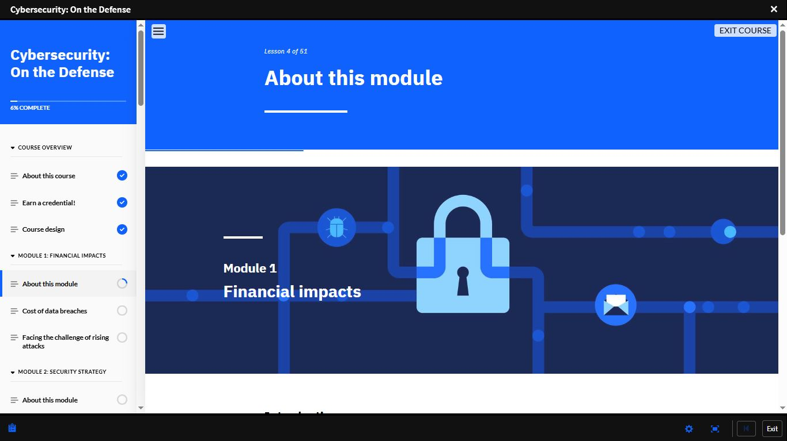
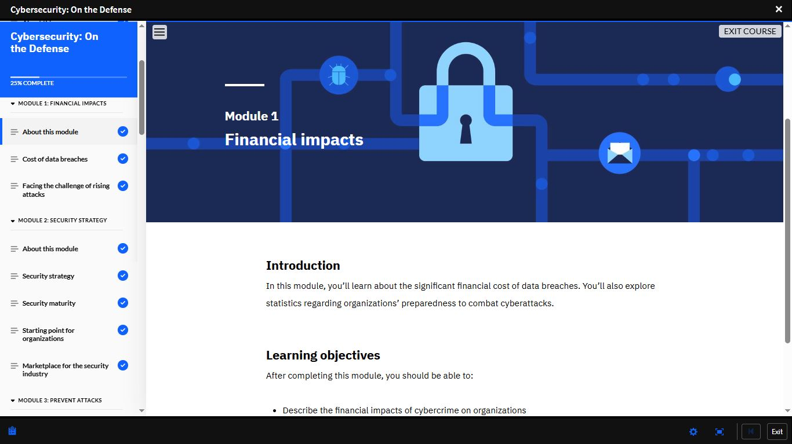
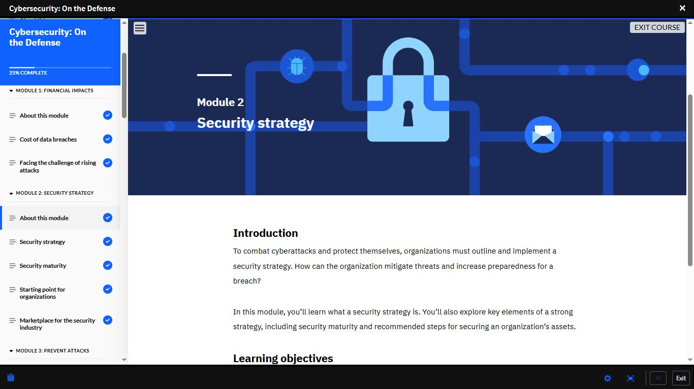
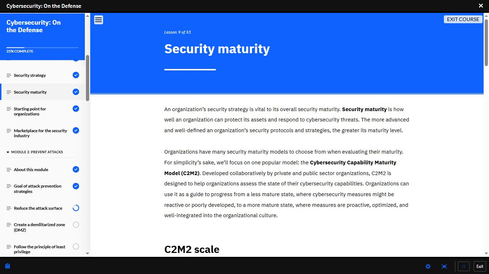

# Day 25 — Cybersecurity: On the Defense | Modules 1–3 Started

**Date:** <!-- insert date -->
**Platform:** IBM SkillsBuild — Cybersecurity: On the Defense
**Progress:** 6% → 25%
**Status:** Modules 1 & 2 complete | Module 3 in progress

---

## 📌 What I Covered Today

### ✅ Module 1: Financial Impacts

Explored the real-world business consequences of
cybersecurity incidents:

- The significant financial cost of data breaches
  to organisations
- Statistics on organisations' preparedness to
  combat cyberattacks
- The challenge of rising attacks and why the
  threat landscape keeps expanding

> Data breaches are not just IT problems.
> They are business-level events with financial,
> legal, and reputational consequences.

---

### ✅ Module 2: Security Strategy

Covered how organisations build and evaluate their
security posture:

- What a security strategy is and why every
  organisation needs one
- Key elements of a strong security strategy
- **Security maturity** — how well an organisation
  can protect its assets and respond to threats
- The **Cybersecurity Capability Maturity Model
  (C2M2)** — a public/private sector framework
  for assessing cybersecurity capabilities,
  guiding organisations from reactive to proactive,
  optimised, and well-integrated security postures
- Starting point recommendations for organisations
- The security industry marketplace

---

### 🔄 Module 3: Prevent Attacks (In Progress)

An organisation's first priority is to prevent a
successful attack from occurring.

| Lesson | Status |
|--------|--------|
| Goal of attack prevention strategies | ✅ Complete |
| Reduce the attack surface | 🔄 In Progress |
| Create a demilitarized zone (DMZ) | ⬜ Not started |
| Follow the principle of least privilege | ⬜ Not started |

---

## 💡 Key Takeaway

> Security maturity is not a destination — it is
> a spectrum. Organisations move from reactive,
> poorly defined security measures toward proactive,
> optimised, and culturally integrated ones.
> The C2M2 model exists to show organisations
> exactly where they stand on that spectrum.

---

## 📸 Screenshots

### Course Start — Module 1: Financial Impacts

### Module 1 Complete — 25% Progress

### Module 2: Security Strategy — Introduction

### Lesson 9: Security Maturity — C2M2 Model

### Module 3: Prevent Attacks — In Progress

---

## 📊 Overall Progress

| Milestone | Status |
|-----------|--------|
| Cisco Module 1–3 | ✅ Complete |
| Cisco Module 4 | 🔄 In Progress |
| IBM — Job Landscape | ✅ Complete |
| IBM — Intro to Cybersecurity | ✅ Complete |
| IBM — Cybersecurity and Data | ✅ Complete |
| IBM — On the Offense | ✅ Complete (93%) |
| IBM — On the Defense | 🔄 25% |
| Days Completed | 25 / 180 |

---

## ✅ Summary

- Started IBM SkillsBuild *Cybersecurity: On the Defense*
- Completed Module 1: Financial Impacts —
  data breach costs, rising attack challenges
- Completed Module 2: Security Strategy —
  security maturity and the C2M2 framework
- Started Module 3: Prevent Attacks —
  attack surface reduction in progress

---

*[← Day 24](day-24.md) | [Day 26 →](day-26.md)*
