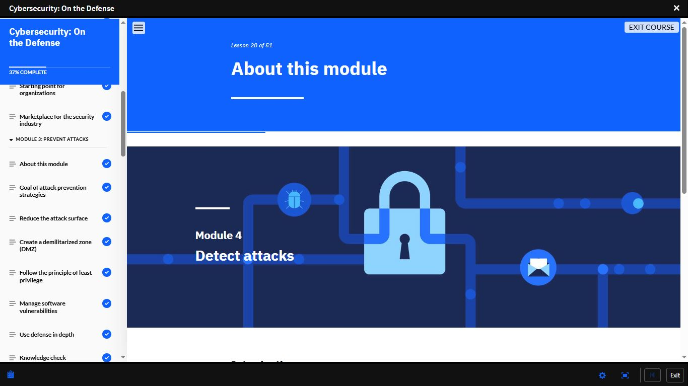

# Day 26 — Cybersecurity: On the Defense | Course Complete

**Date:** <!-- 08/06/2026 -->
**Platform:** IBM SkillsBuild — Cybersecurity: On the Defense
**Progress:** 25% → 98% → Complete
**Milestone:** Final Assessment — 90% ✅

---

## 📊 Final Assessment Result

| Attempt | Score | Status |
|---------|-------|--------|
| **Attempt 1 (Day 26)** | **90%** | **✅ Passed** |
| Passing Threshold | 80% | — |

> Prevention, detection, response, cryptography,
> threat intelligence — all of it consolidated
> into a single assessment. 90% confirmed the
> understanding was there.

---

## 📌 What I Covered Today

### ✅ Module 3: Prevent Attacks (Completed)
**Progress at start:** 25% | **Lesson:** ~9 of 51

Completed all remaining lessons:

- Reduce the attack surface
- Create a demilitarized zone (DMZ)
- Follow the principle of least privilege
- Manage software vulnerabilities
- Use defense in depth
- Knowledge check

> Preventing a successful attack requires multiple
> overlapping layers — no single control is enough.

---

### ✅ Module 4: Detect Attacks
**Lesson 20 of 51 | Progress: 37%**

Because no prevention strategy is perfect,
organisations must also focus on how quickly
they can identify a breach when it occurs.
Covered detection strategies and tools
organisations use to identify active threats.

---

### ✅ Module 5: Respond to Attacks
**Lesson 29 of 51 | Progress: 54%**

Covered what happens after detection:

- Incident response frameworks
- Preparing for incidents before they occur
- Business continuity and disaster recovery
- Benefit of incident response teams
- Activity: Design a personal incident response plan

> The response plan determines how much damage
> an attack actually causes. Detection without
> a response plan is not enough.

---

### ✅ Module 6: Introducing Cryptography
**Lesson 35 of 51 | Progress: 65% → 77%**

Shifted into the foundational technology behind
secure communications:

- What is cryptography?
- Defining secure communications
- Encryption
- Activity: Order the steps of asymmetric encryption
- Quantum encryption

> Cryptography is not optional knowledge for
> anyone working in cybersecurity — it underpins
> every secure system in existence.

---

### ✅ Module 7: Introducing Threat Intelligence
**Lesson 41 of 51 | Progress: 77%**

Closed out the course content with intelligence:

- What is threat intelligence?
- Benefits of threat intelligence
- Sources of threat intelligence
- Artificial intelligence (AI) and threat intelligence
- Key takeaway
- Activity: Research threat intelligence
- Sources

> Threat intelligence shifts an organisation from
> reactive to proactive. Knowing what is coming
> is more valuable than only knowing what arrived.

---

## 📸 Screenshots

### Module 3: Prevent Attacks — Completed

### Module 5: Respond to Attacks — Started

### Module 6: Introducing Cryptography — Started

### Module 7: Introducing Threat Intelligence — Started

### Final Assessment — 90% ✅

---

## 💡 Key Takeaway

> The full defensive cycle is: Prevent → Detect →
> Respond. Cryptography and threat intelligence
> are the tools that make each stage more effective.
> Understanding all three stages — not just
> prevention — is what separates a prepared
> organisation from a vulnerable one.

---

## 📊 Overall Progress

| Milestone | Status |
|-----------|--------|
| Cisco Module 1–3 | ✅ Complete |
| Cisco Module 4 | 🔄 In Progress |
| IBM — Job Landscape | ✅ Complete |
| IBM — Intro to Cybersecurity | ✅ Complete |
| IBM — Cybersecurity and Data | ✅ Complete |
| IBM — On the Offense | ✅ Complete (93%) |
| IBM — On the Defense | ✅ Complete (90%) |
| Days Completed | 26 / 180 |

---

## ✅ Summary

- Completed Modules 3–7 of *Cybersecurity: On the Defense*
- Module 3: Prevent Attacks — attack surface,
  DMZ, least privilege, defense in depth
- Module 4: Detect Attacks — detection strategies
- Module 5: Respond to Attacks — incident response,
  business continuity, recovery planning
- Module 6: Cryptography — encryption, asymmetric
  encryption, quantum encryption
- Module 7: Threat Intelligence — sources, AI
  integration, proactive defence
- Final Assessment: 90% ✅ — course complete

---

*[← Day 25](day-25.md) | [Day 27 →](day-27.md)*
