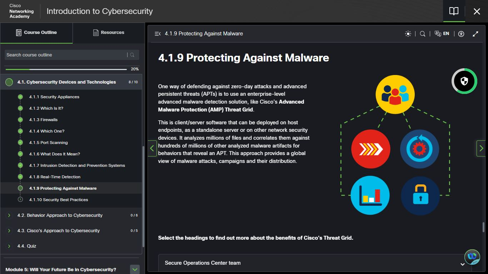
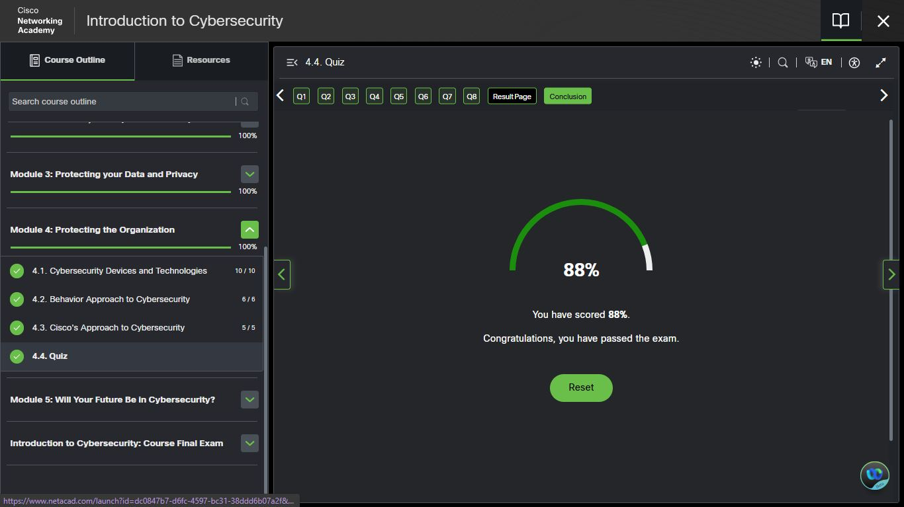
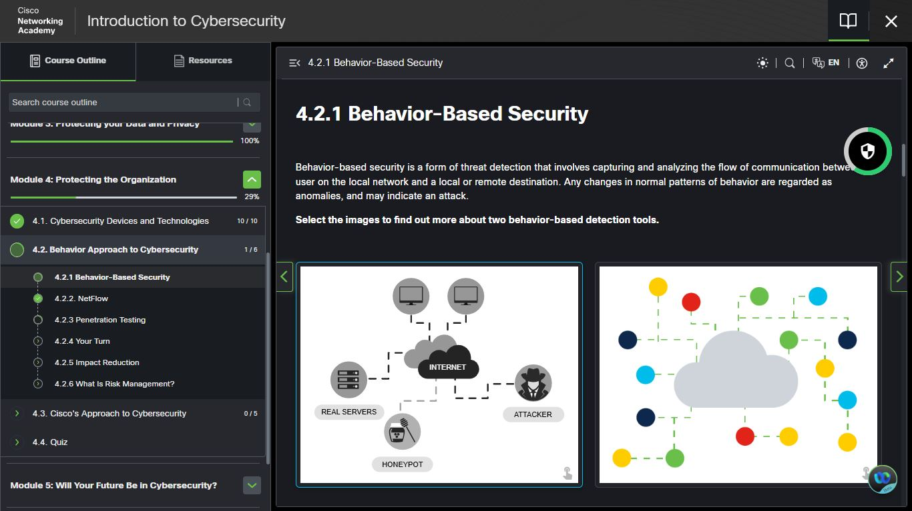
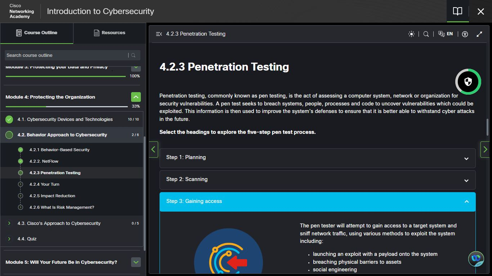

# Day 27 — Cisco: Introduction to Cybersecurity | Module 4 + Final Exam

**Date:** <!-- 10/06/2026 -->
**Platform:** Cisco Networking Academy — Introduction to Cybersecurity
**Progress:** Module 4 in progress | Course Final Exam complete
**Milestones:** 4.1 Quiz — 88% ✅ | Course Final Exam — 87% ✅

---

## 📊 Quiz & Exam Results

| Assessment | Score | Status |
|------------|-------|--------|
| 4.1 Quiz (Cybersecurity Devices and Technologies) | 88% | ✅ Passed |
| Course Final Exam | 87% | ✅ Passed |

---

## 📌 What I Covered Today

### ✅ Section 4.1: Cybersecurity Devices and Technologies (10/10)

Completed all lessons covering the tools and
technologies organisations use to defend their
networks:

- Security appliances
- Firewalls and which type to use
- Port scanning
- Intrusion detection and prevention systems
- Real-time detection
- Protecting against malware

> One way of defending against zero-day attacks
> and advanced persistent threats (APTs) is using
> an enterprise-level malware detection solution
> like Cisco's Advanced Malware Protection (AMP)
> Threat Grid — client/server software that
> analyzes millions of files and correlates them
> against hundreds of millions of known malware
> artifacts to reveal APTs across an entire network.

**4.1 Quiz: 88%** ✅

---

### 🔄 Section 4.2: Behavior Approach to Cybersecurity (2/6)

Started exploring how organisations detect attacks
based on behavioural anomalies rather than known
signatures:

- **Behavior-Based Security** — capturing and
  analyzing communication flow between users and
  destinations. Any deviation from normal patterns
  is treated as a potential attack. Covered two
  behavior-based detection tools, including
  honeypots used to lure attackers away from
  real servers.
- **NetFlow** — completed
- **Penetration Testing** — in progress. The
  five-step pen test process: Planning, Scanning,
  Gaining Access, Maintaining Access, and Covering
  Tracks. Pen testing seeks to breach systems,
  people, processes, and code to uncover
  vulnerabilities before real attackers do.

---

### ✅ Course Final Exam — Introduction to Cybersecurity

Completed the full course final exam covering:

- Module 2: Attacks, Concepts and Techniques (100%)
- Module 3: Protecting Your Data and Privacy (100%)
- Module 4: Protecting the Organization (100%)
- Module 5: Will Your Future Be in Cybersecurity? (100%)

**Final Exam Score: 87%** ✅ — Course passed at 100%

---

## 📸 Screenshots

### Section 4.1.9 — Protecting Against Malware

### Section 4.1 Quiz — 88%

### Course Final Exam — 87%

### Section 4.2.3 — Penetration Testing

### Section 4.2.1 — Behavior-Based Security

---

## 💡 Key Takeaway

> Defense isn't only about known threats —
> behavior-based security and tools like
> honeypots catch what signature-based detection
> misses. And penetration testing flips the
> perspective entirely: finding your own
> weaknesses before someone else does.

---

## 📊 Overall Progress

| Milestone | Status |
|-----------|--------|
| Cisco — Intro to Cybersecurity | ✅ Complete (87%) |
| Cisco Module 4 | 🔄 In Progress |
| IBM — Job Landscape | ✅ Complete |
| IBM — Intro to Cybersecurity | ✅ Complete |
| IBM — Cybersecurity and Data | ✅ Complete |
| IBM — On the Offense | ✅ Complete (93%) |
| IBM — On the Defense | ✅ Complete (90%) |
| Days Completed | 27 / 180 |

---

## ✅ Summary

- Completed Section 4.1: Cybersecurity Devices
  and Technologies — passed quiz with 88%
- Started Section 4.2: Behavior Approach to
  Cybersecurity — behavior-based security,
  NetFlow, penetration testing
- Completed Cisco's Introduction to Cybersecurity
  Course Final Exam — passed with 87%
- Course now fully complete at 100%

---

*[← Day 26](day-26.md) | [Day 28 →](day-28.md)*
