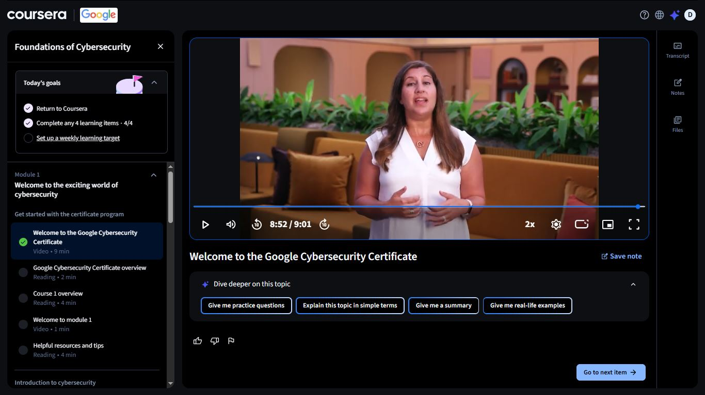
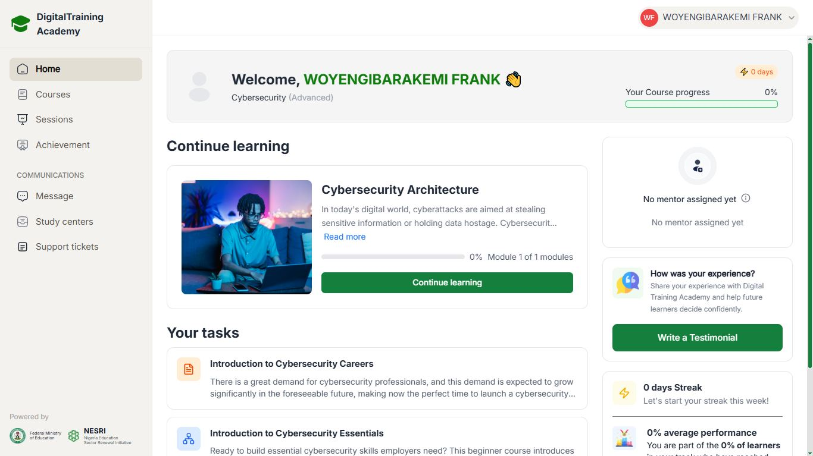

# Day 29 — Back on Track | Google Cybersecurity Certificate Begins

**Date:** 2026-09-11
**Platform:** Coursera (Google Cybersecurity Professional Certificate) + DigitalTraining Academy (DTA)
**Status:** 🔄 Restarted after a break
**Milestone:** Sponsored enrollment — Google Cybersecurity Professional Certificate

---

## ⏸️ The Break

It's been a while since Day 28.

School exams and a few programs took over my schedule for a stretch, and the journey paused. Not abandoned — paused. There's a difference, and it matters.

Day 29 marks the return.

---

## 🎓 New Chapter: DTA Sponsorship

This next phase of the journey is sponsored by **DigitalTraining Academy (DTA)**, under the **Federal Ministry of Education** and the **Nigeria Education Sector Renewal Initiative (NESRI)**.

They're funding my access to the **Google Cybersecurity Professional Certificate** on Coursera — a structured, industry-recognised program built by Google.

Grateful for this. Sponsorship like this removes a real barrier for a lot of people trying to break into this field, and I don't take it lightly.

---

## 📁 What I Covered Today

### Coursera — Foundations of Cybersecurity (Module 1)

Started the first course in the Google Cybersecurity Certificate.

| Item | Type | Duration | Status |
|------|------|----------|--------|
| Welcome to the Google Cybersecurity Certificate | Video | 9 min | ✅ Complete |
| Google Cybersecurity Certificate overview | Reading | 2 min | ✅ Complete |
| Course 1 overview | Reading | 4 min | ✅ Complete |
| Welcome to module 1 | Video | 1 min | ✅ Complete |

**Today's goal: Complete any 4 learning items — 4/4 ✅**

> First video framed the certificate well — what cybersecurity actually is,
> why the field matters right now, and what the program will build toward.
> A solid, grounded start. No fluff.

---

### DigitalTraining Academy (DTA) — Platform Setup

Alongside Coursera, DTA has its own learning track running in parallel.

| Course | Progress |
|--------|----------|
| Cybersecurity Architecture | 0% — Module 1 of 1 |
| Introduction to Cybersecurity Careers | Assigned |
| Introduction to Cybersecurity Essentials | Assigned |

Just getting oriented on this platform today — dashboard, task list, course structure. Real progress on these starts next session.

---

## 📸 Screenshots

### Coursera — Google Cybersecurity Certificate (Module 1)

### DTA — Dashboard & Course Overview

---

## 📊 Overall Progress

| Milestone | Status |
|-----------|--------|
| Cisco Module 1–3 | ✅ Complete |
| Cisco Module 4 | 🔄 In Progress |
| IBM — Job Landscape | ✅ Complete (100%) |
| IBM — Intro to Cybersecurity | ✅ Complete (80%) |
| IBM — Malwarebytes | ✅ 78% |
| IBM — On the Offense | ✅ Complete (93%) |
| IBM — On the Defense | ✅ Complete (90%) |
| Coursera — Google Cybersecurity Certificate | 🆕 Started |
| DTA — Cybersecurity Architecture | 🆕 Started (0%) |
| Days Completed | 29 / 180 |

---

## ✅ Summary

- Returned to the journey after a break for school exams and other commitments
- New sponsor on board: **DigitalTraining Academy (DTA)**, backed by the Federal Ministry of Education and NESRI
- Started the **Google Cybersecurity Professional Certificate** on Coursera — Module 1 complete
- Registered and oriented on the DTA platform — Cybersecurity Architecture course in progress
- Back fully. Learning continues.

---

*[← Day 26](day-26.md) | [Day 30 →](day-30.md)*
