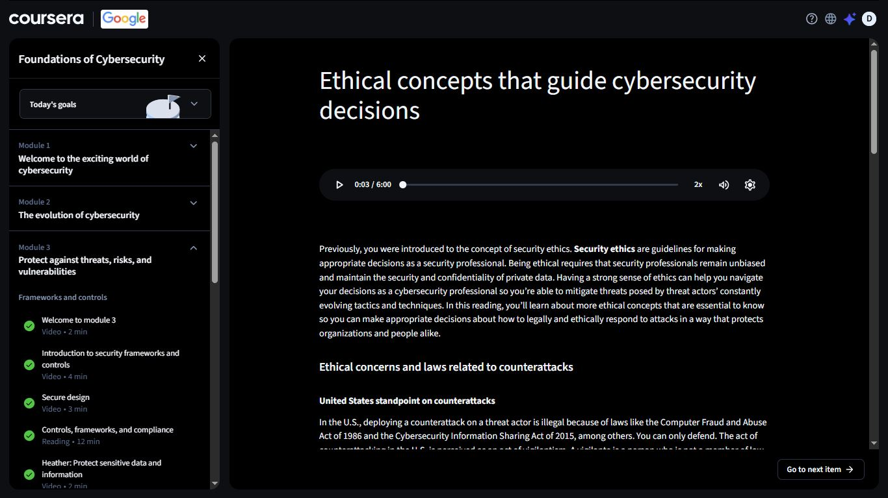
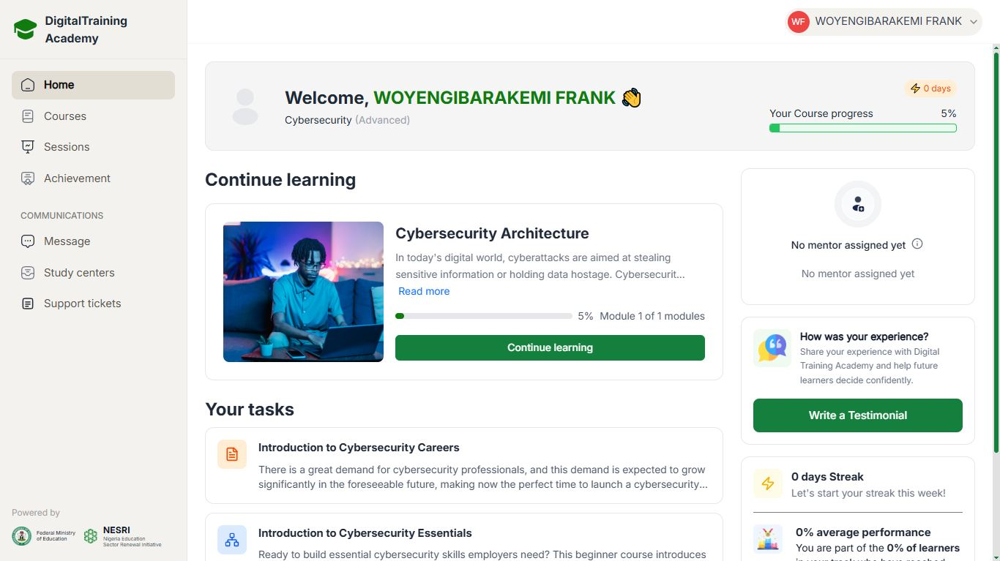

# Day 30 — Foundations of Cybersecurity | Module 3 In Progress

**Date:** 2026-09-12
**Platform:** Coursera (Google Cybersecurity Professional Certificate) + DigitalTraining Academy (DTA)
**Progress:** DTA — 0% → 5% | Coursera — Module 1 → Module 3

---

## 📁 Coursera — Foundations of Cybersecurity

Moved through Module 1 and Module 2, now deep into **Module 3: Protect against threats, risks, and vulnerabilities**.

### Module 3 — Frameworks and Controls

| Item | Type | Duration | Status |
|------|------|----------|--------|
| Welcome to module 3 | Video | 2 min | ✅ Complete |
| Introduction to security frameworks and controls | Video | 4 min | ✅ Complete |
| Secure design | Video | 3 min | ✅ Complete |
| Controls, frameworks, and compliance | Reading | 12 min | ✅ Complete |
| Heather: Protect sensitive data and information | Video | 7 min | ✅ Complete |
| Ethical concepts that guide cybersecurity decisions | Reading | — | 🔄 In Progress |

---

### Key Concepts

**Security frameworks and controls**
- Frameworks give structure to how an organisation approaches risk — a repeatable set of guidelines rather than ad-hoc decisions
- Controls are the actual safeguards put in place to reduce risk: technical, operational, and managerial
- Secure design builds protection into a system from the start rather than patching it in later

**Ethics in cybersecurity**
- Security ethics are guidelines for making appropriate decisions as a security professional
- Being ethical means staying unbiased and protecting the confidentiality of private data, even under pressure
- Ethics is what lets a professional navigate constantly evolving threat actor tactics without crossing a line themselves

**Counterattacks — legal and ethical boundaries**
- In the U.S., deploying a counterattack against a threat actor is illegal
- Covered under laws including the **Computer Fraud and Abuse Act (1986)** and the **Cybersecurity Information Sharing Act (2015)**
- The professional standard is clear: you can only defend. Counterattacking is treated as an act of vigilantism, not security work

> This part stood out. There's a real temptation to think "fighting back" is part of the job.
> It isn't. The law draws a hard line, and the ethics back it up.
> Knowing where that line sits matters as much as knowing how to detect a threat in the first place.

---

## 🎓 DigitalTraining Academy (DTA)

| Course | Progress |
|--------|----------|
| Cybersecurity Architecture | 5% — Module 1 of 1 |
| Introduction to Cybersecurity Careers | Assigned |
| Introduction to Cybersecurity Essentials | Assigned |

First real movement on the Cybersecurity Architecture course — off the 0% starting point from Day 29.

---

## 📸 Screenshots

### Coursera — Foundations of Cybersecurity (Module 3)

### DTA — Dashboard (5% Progress)

---

## 📊 Overall Progress

| Milestone | Status |
|-----------|--------|
| Coursera — Google Cybersecurity Certificate | 🔄 Module 3 in progress |
| DTA — Cybersecurity Architecture | 🔄 5% |
| Days Completed | 30 / 180 |

---

## ✅ Summary

- Advanced through Coursera's Foundations of Cybersecurity into Module 3
- Covered security frameworks, controls, secure design, and protecting sensitive data
- Currently on ethical concepts — specifically the legal boundary around counterattacks (CFAA 1986, Cybersecurity Information Sharing Act 2015)
- DTA's Cybersecurity Architecture course now at 5%, moving off the starting line

---

*[← Day 29](day-29.md) | [Day 31 →](day-31.md)*
