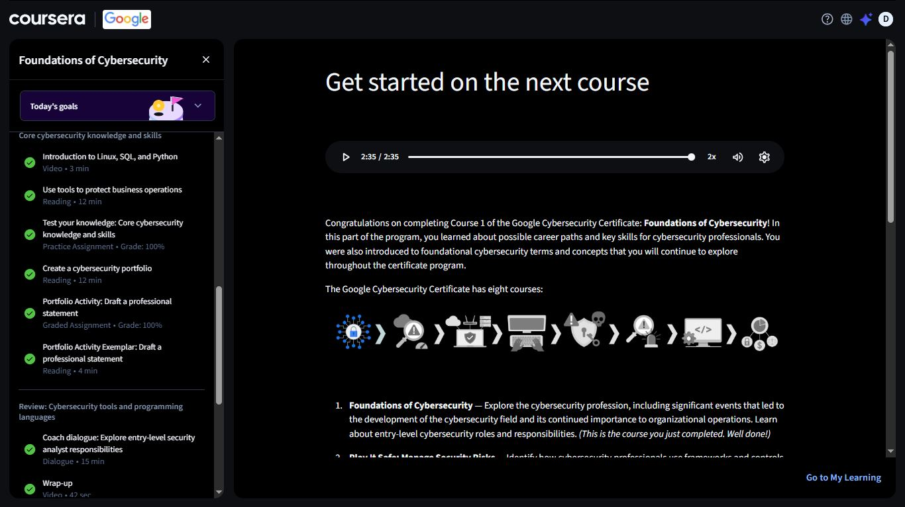

# Day 31 — Foundations of Cybersecurity | Course 1 Complete 🎓

**Date:** 2026-09-14
**Platform:** Coursera (Google Cybersecurity Professional Certificate)
**Progress:** Module 3 → Course Complete
**Milestone:** Course 1 of 8 — Certificate Issued ✅

---

## 🏆 Certificate

**Foundations of Cybersecurity** — completed and certified by Google, issued through Coursera.

| Detail | Info |
|--------|------|
| Issued | Sep 14, 2026 |
| Issued to | Woyengibarakemi DivineFavour Frank |
| Authorized by | Google |
| Signed by | Amanda Brophy, Global Director of Google Career Certificates |
| Verify | https://coursera.org/verify/8S096QBQMSMK |

This is Course 1 of 8 in the Google Cybersecurity Professional Certificate.

---

## 📁 What I Covered

### Core Cybersecurity Knowledge and Skills

| Item | Type | Duration | Result |
|------|------|----------|--------|
| Introduction to Linux, SQL, and Python | Video | 3 min | ✅ Complete |
| Use tools to protect business operations | Reading | 12 min | ✅ Complete |
| Test your knowledge: Core cybersecurity knowledge and skills | Practice Assignment | — | ✅ 100% |
| Create a cybersecurity portfolio | Reading | 12 min | ✅ Complete |
| Portfolio Activity: Draft a professional statement | Graded Assignment | — | ✅ 100% |
| Portfolio Activity Exemplar: Draft a professional statement | Reading | 4 min | ✅ Complete |

### Review: Cybersecurity Tools and Programming Languages

| Item | Type | Duration | Status |
|------|------|----------|--------|
| Coach dialogue: Explore entry-level security analyst responsibilities | Dialogue | 15 min | ✅ Complete |
| Wrap-up | Video | 42 sec | ✅ Complete |

---

## 📚 Course Recap

Foundations of Cybersecurity covered the shape of the field itself — the events that led to cybersecurity becoming what it is today, why it matters to organisational operations, and what an entry-level role actually looks like day to day.

The two graded pieces mattered most:

- **Test your knowledge (100%)** — checkpoint on core concepts before moving forward
- **Draft a professional statement (100%)** — first real step toward building a cybersecurity portfolio, not just consuming content

> Starting a portfolio this early feels right.
> Documentation isn't something to bolt on at the end of a program —
> it's a habit worth building alongside the learning itself.

---

## 🗺️ What's Next — The Full Certificate Path

The Google Cybersecurity Certificate is eight courses. Foundations was the first.

| # | Course | Status |
|---|--------|--------|
| 1 | Foundations of Cybersecurity | ✅ Complete |
| 2 | Play It Safe: Manage Security Risks | 🔜 Next |
| 3 | Connect and Protect: Networks and Network Security | ⬜ Pending |
| 4 | Tools of the Trade: Linux and SQL | ⬜ Pending |
| 5 | Assets, Threats, and Vulnerabilities | ⬜ Pending |
| 6 | Sound the Alarm: Detection and Response | ⬜ Pending |
| 7 | Automate Cybersecurity Tasks with Python | ⬜ Pending |
| 8 | Put It to Work: Prepare for Cybersecurity Jobs | ⬜ Pending |

---

## 📸 Screenshots

### Course Wrap-Up — Get Started on the Next Course

### Certificate — Foundations of Cybersecurity

---

## 📊 Overall Progress

| Milestone | Status |
|-----------|--------|
| Coursera — Foundations of Cybersecurity | ✅ Complete (Course 1 of 8) |
| Coursera — Play It Safe: Manage Security Risks | 🔜 Next |
| DTA — Cybersecurity Architecture | 🔄 5% |
| Days Completed | 31 / 180 |

---

## ✅ Summary

- Completed **Foundations of Cybersecurity**, Course 1 of the Google Cybersecurity Professional Certificate
- Practice assignment and portfolio activity both scored 100%
- Started building a cybersecurity portfolio — professional statement drafted
- Certificate verified and issued by Coursera/Google
- Seven courses left in the certificate path — Play It Safe: Manage Security Risks is next

---

*[← Day 30](day-30.md) | [Day 32 →](day-32.md)*
