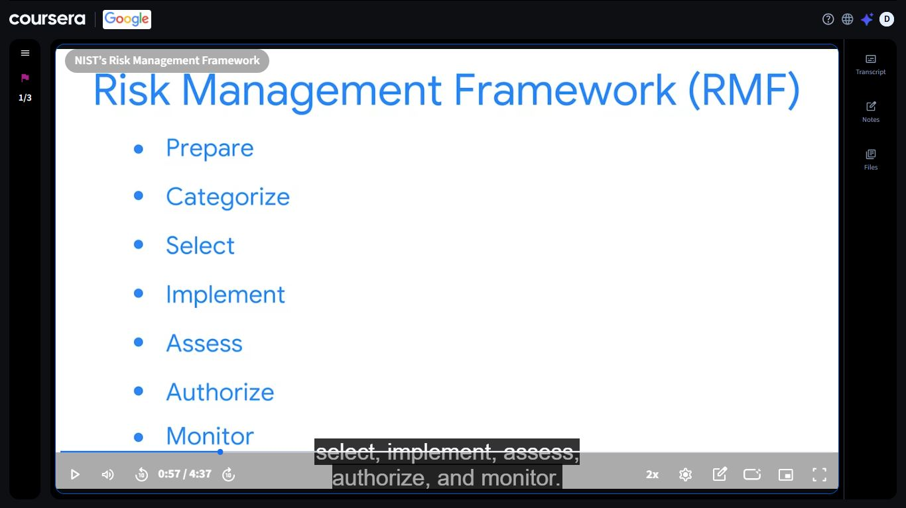
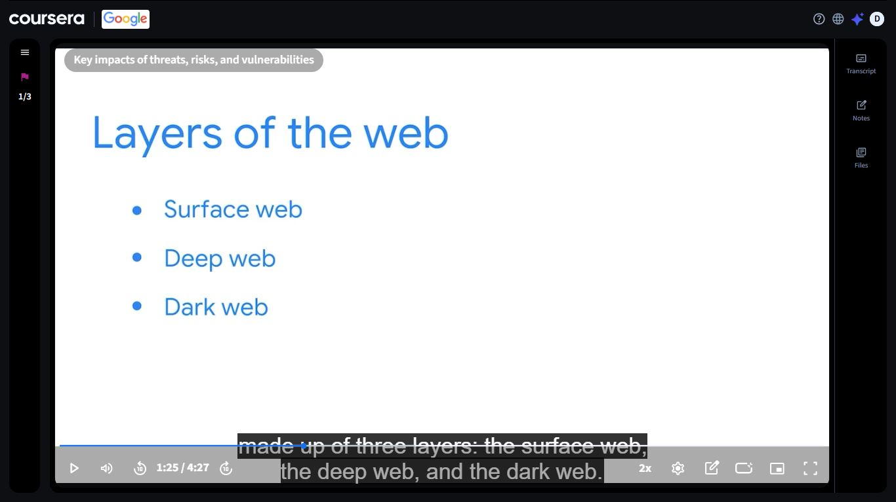

# Day 32: NIST Risk Management Framework & The Layers of the Web

**Date:** September 17, 2026
**Platform:** Coursera: Google Cybersecurity Professional Certificate (sponsored by DigitalTraining Academy)
**Progress:** Day 32 of 180
**Milestone:** Module 3 (Protect against threats, risks, and vulnerabilities), NIST RMF and dark web concepts covered

---

## 📌 Overview

Day 32 stayed inside Module 3 of the Google Cybersecurity Professional Certificate. Two videos today, and they connect more than I expected:

1. **NIST's Risk Management Framework (RMF)**: a seven-step process for managing security and privacy risk
2. **Key impacts of threats, risks, and vulnerabilities**: starting with the three layers of the web

One is about how organizations manage risk on purpose. The other is about where the fallout of unmanaged risk ends up.

---

## 🛡️ NIST Risk Management Framework (RMF)

The RMF gives organizations a repeatable way to manage risk across the life of a system. The video walks through seven steps:

| Step | Concept | What it means |
|------|---------|---------------|
| 1. Prepare | Get ready to manage risk | Define roles, priorities, and the risk context for the organization and its systems |
| 2. Categorize | Understand what's at stake | Classify the system and the information it handles based on the impact of a loss |
| 3. Select | Choose the protections | Pick the security controls that fit the system's categorization |
| 4. Implement | Put controls in place | Deploy the selected controls and document how they're used |
| 5. Assess | Check that they work | Test whether the controls are in place and producing the intended result |
| 6. Authorize | Make the call | A responsible official decides whether the remaining risk is acceptable |
| 7. Monitor | Keep watching | Continuously track the system and controls for changes and new risks |

> **Reflection:** I first read this as a checklist. It's closer to a loop: Monitor feeds back into everything before it, because systems and threats keep changing after the sign-off.

### 🔍 SOC Analyst Relevance

- **Monitor** is where a SOC lives day to day: alerts, logs, and continuous visibility into whether controls are holding up
- **Categorize** explains why some alerts get escalated faster than others: the system involved and the data it holds change the impact
- **Assess** connects to vulnerability scanning and control testing, which feed what analysts see
- Knowing the RMF vocabulary makes it easier to understand how a SOC fits into an organization's bigger compliance and risk picture

---

## 🌐 Layers of the Web

The second video, *Key impacts of threats, risks, and vulnerabilities*, opens by breaking the web into three layers:

| Layer | Concept | Description |
|-------|---------|-------------|
| Surface web | The public, searchable part | Content that search engines index and anyone can reach |
| Deep web | Not indexed, but not necessarily shady | Content behind logins or paywalls: email, online banking, private accounts, records |
| Dark web | Intentionally hidden | Only reachable with specialized software; a mix of privacy uses and criminal marketplaces |

### 🔍 SOC Analyst Relevance

- Stolen credentials and leaked data often surface on the dark web, so **dark web monitoring** is a real part of threat intelligence work
- Most of what organizations need to protect sits in the **deep web** layer: accounts and data that are private, not hidden
- Understanding the layers helps frame the *impact* side of risk: what happens to data after a breach

---

## 📸 Screenshots

| Screenshot | File |
|------------|------|
| NIST Risk Management Framework, seven steps | `../images/day-32/NIST.JPG` |
| Layers of the web, Key impacts of threats, risks, and vulnerabilities | `../images/day-32/Key_Impacts.JPG` |

---

## 📊 Overall Progress Tracker

| Platform | Course / Module | Status | Score |
|----------|-----------------|--------|-------|
| Cisco NetAcad | Module 1 | ✅ Complete | 100% |
| Cisco NetAcad | Module 2 | ✅ Complete | 88% |
| Cisco NetAcad | Module 3 | ✅ Complete | 83% |
| IBM SkillsBuild | Job Landscape | ✅ Complete | 100% |
| IBM SkillsBuild | Intro to Cybersecurity | ✅ Complete | 80% |
| IBM SkillsBuild | On the Offense | ✅ Complete | 93% (47% on first attempt) |
| IBM SkillsBuild | On the Defense | ✅ Complete | 90% |
| IBM SkillsBuild | Malwarebytes | ✅ Complete | 78% |
| Coursera (Google) | Cybersecurity Professional Certificate, Module 3 | 🔄 In progress | N/A |
| DTA | Cybersecurity Architecture | 🔄 In progress | 5% (update if changed) |
| NotebookLM | Quiz | ✅ Done | 24/30 |

---

## ✅ Summary

- Covered the seven steps of the NIST Risk Management Framework: Prepare, Categorize, Select, Implement, Assess, Authorize, Monitor
- Learned the three layers of the web: surface, deep, and dark
- Connected RMF's Monitor step to what a SOC does every day
- Connected dark web activity to threat intelligence and credential leak monitoring
- Continuing through Coursera Module 3

---

## 🧭 Navigation

⬅️ [Day 31](./day-31.md) | [Back to Journey Home](../README.md) | [Day 33](./day-33.md) ➡️
