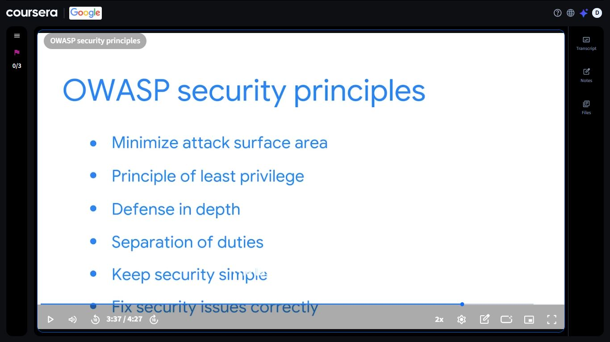
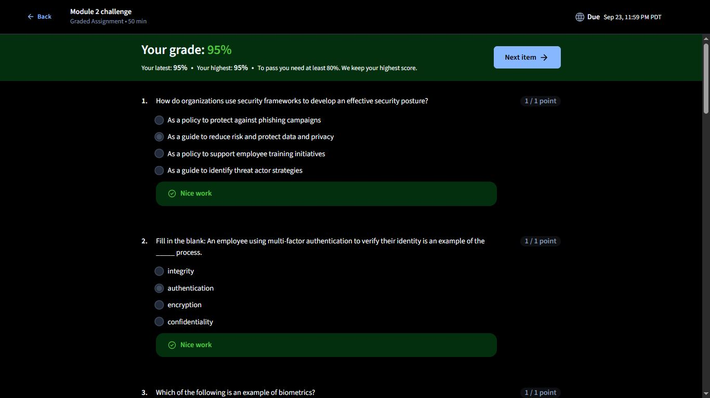
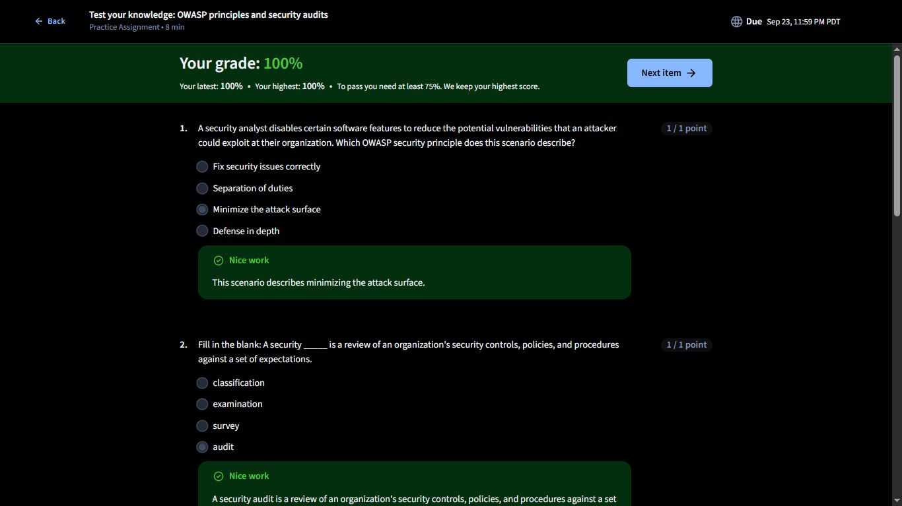
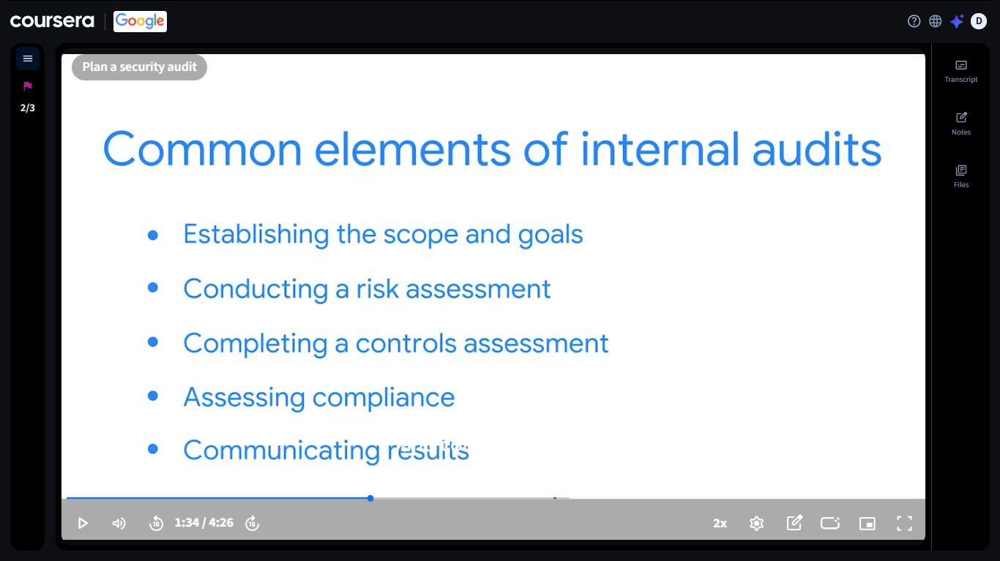
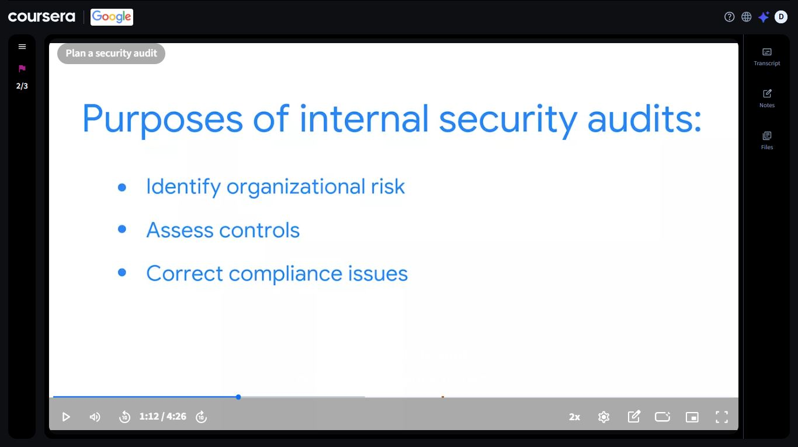

# Day 33: OWASP Security Principles & Internal Security Audits

**Date:** September 18, 2026
**Platform:** Coursera: Google Cybersecurity Professional Certificate (sponsored by DigitalTraining Academy)
**Progress:** Day 33 of 180
**Milestone:** Module 2 challenge passed (95%) and OWASP principles and security audits practice quiz (100%)

---

## 📌 Overview

Day 33 was about two connected ideas: how organizations **build** security into their systems, and how they **check** that it's actually working.

1. **OWASP security principles**: six guidelines for designing and running systems more securely
2. **Internal security audits**: why they exist and the common elements involved in planning one

The day also included a practice quiz on both topics (100%) and the graded Module 2 challenge (95%).

---

## 🛡️ OWASP Security Principles

OWASP (the Open Web Application Security Project) publishes guidance for building and operating software more securely. The video covered six principles:

| Principle | Concept | What it means |
|-----------|---------|---------------|
| Minimize attack surface area | Fewer ways in | Reduce the points where an attacker could get in, for example by disabling software features that aren't needed |
| Principle of least privilege | Only the access you need | Users and systems get the minimum permissions required to do their job |
| Defense in depth | Multiple layers | Stack several controls so one failure doesn't expose everything |
| Separation of duties | No single point of control | Split critical tasks between people so no one person can misuse or bypass the process alone |
| Keep security simple | Simple is easier to secure | Overly complex designs are harder to understand, maintain, and defend |
| Fix security issues correctly | Fix the cause, not the symptom | Find the root cause of a vulnerability and confirm the fix works, instead of patching over it |

### 🔍 SOC Analyst Relevance

- **Least privilege** and **separation of duties** are what make account misuse stand out in logs: activity outside a user's normal access is a signal worth investigating
- **Defense in depth** is why a SOC pulls in many sources (firewalls, endpoints, identity systems) rather than trusting one control
- **Minimize attack surface** connects directly to vulnerability findings: fewer exposed services means fewer alerts and fewer ways in
- **Fix security issues correctly** matters after an incident, when the goal is to close the actual gap and not just the visible symptom

---

## 🧾 Internal Security Audits

The second video, *Plan a security audit*, started with what a security audit is: a review of an organization's security controls, policies, and procedures measured against a set of expectations.

### Purposes of internal security audits

| Purpose | What it means |
|---------|---------------|
| Identify organizational risk | Find where the organization is exposed |
| Assess controls | Check whether the controls in place are doing their job |
| Correct compliance issues | Find and fix gaps against regulations, standards, and internal policy |

### Common elements of internal audits

| Element | What it involves |
|---------|------------------|
| Establishing the scope and goals | Decide what is being audited and what the audit should achieve |
| Conducting a risk assessment | Identify the risks to the assets in scope |
| Completing a controls assessment | Review the existing controls and look for gaps |
| Assessing compliance | Compare practices against the relevant regulations and policies |
| Communicating results | Report the findings and recommendations to the people who need them |

> **Key idea:** This ties back to Day 32. The RMF's Assess step and internal audits both come down to the same question: are the controls actually working, or are we just assuming they are?

### 🔍 SOC Analyst Relevance

- Logs and alerts are often the **evidence** audits rely on when checking whether controls work and whether policies are followed
- A **controls assessment** reveals detection gaps, which is useful context for anyone tuning or triaging alerts
- **Communicating results** is a skill analysts use constantly, in incident reports and handoffs as much as in audits

---

## 📝 Assessments

| Assessment | Type | Score | Pass mark |
|------------|------|-------|-----------|
| Test your knowledge: OWASP principles and security audits | Practice assignment (8 min) | ✅ 100% | 75% |
| Module 2 challenge | Graded assignment (50 min) | ✅ 95% | 80% |

Topics that appeared in the questions:

- Security frameworks as a guide to reduce risk and protect data and privacy
- Multi-factor authentication as an example of the **authentication** process
- Biometrics as a form of verification
- A scenario about disabling software features, which maps to **minimizing the attack surface**
- The definition of a security **audit**

---

## 📸 Screenshots

| Screenshot | File |
|------------|------|
| OWASP security principles slide | `../images/day-33/OWASP.JPG` |
| Module 2 challenge result (95%) | `../images/day-33/Final_Test.JPG` |
| Practice quiz result: OWASP principles and security audits (100%) | `../images/day-33/OWASP2.JPG` |
| Common elements of internal audits | `../images/day-33/Internal_Audit.JPG` |
| Purposes of internal security audits | `../images/day-33/Security_Audit.JPG` |

---

## 📊 Overall Progress Tracker

| Platform | Course / Module | Status | Score |
|----------|-----------------|--------|-------|
| Cisco NetAcad | Module 1 | ✅ Complete | 100% |
| Cisco NetAcad | Module 2 | ✅ Complete | 88% |
| Cisco NetAcad | Module 3 | ✅ Complete | 83% |
| Cisco NetAcad | Module 4 (4.1 Quiz) | ✅ Complete | 88% |
| Cisco NetAcad | Introduction to Cybersecurity Final Exam | ✅ Passed | 87% |
| IBM SkillsBuild | Job Landscape | ✅ Complete | 100% |
| IBM SkillsBuild | Intro to Cybersecurity | ✅ Complete | 80% |
| IBM SkillsBuild | On the Offense | ✅ Complete | 93% (47% on first attempt) |
| IBM SkillsBuild | On the Defense | ✅ Complete | 90% |
| IBM SkillsBuild | Malwarebytes | ✅ Complete | 78% |
| Coursera (Google) | Practice: OWASP principles and security audits | ✅ Complete | 100% |
| Coursera (Google) | Module 2 challenge | ✅ Passed | 95% |
| Coursera (Google) | Cybersecurity Professional Certificate overall | 🔄 In progress | N/A |
| DTA | Cybersecurity Architecture | 🔄 In progress | 5% (update if changed) |
| NotebookLM | Quiz | ✅ Done | 24/30 |

---

## ✅ Summary

- Covered the six OWASP security principles: minimize attack surface area, least privilege, defense in depth, separation of duties, keep security simple, fix security issues correctly
- Learned the three purposes of internal security audits and the five common elements of planning one
- Scored 100% on the OWASP principles and security audits practice quiz
- Passed the graded Module 2 challenge with 95%
- Connected audits back to the NIST RMF's Assess step from Day 32

---

## 🧭 Navigation

⬅️ [Day 32](./day-32.md) | [Day 34](./day-34.md) ➡️
