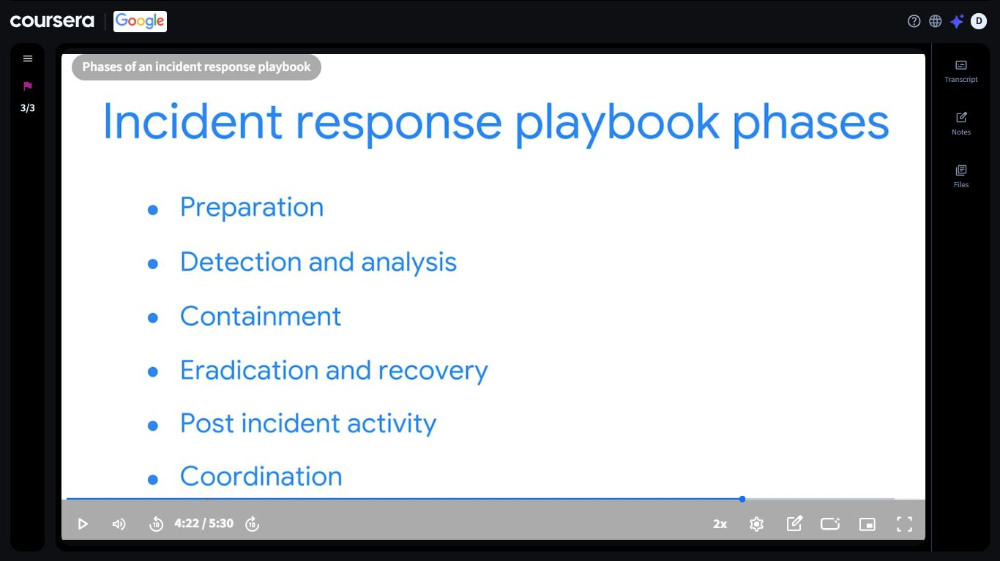

# Day 34: SIEM Tools, Incident Response Playbooks & Course 2 Complete

**Date:** September 19, 2026
**Platform:** Coursera: Google Cybersecurity Professional Certificate (sponsored by DigitalTraining Academy)
**Progress:** Day 34 of 180
**Milestone:** Completed Modules 3 and 4 and finished *Play It Safe: Manage Security Risks*, the second course of the certificate 🎓

---

## 📌 Overview

Day 34 closed out **Play It Safe: Manage Security Risks**. The last two modules moved from frameworks and audits into the practical side of the job:

1. **Module 3**: security information and event management (SIEM) tools and how analysts use SIEM dashboards
2. **Module 4**: playbooks, and how security teams use them to respond to incidents

Together they answer two questions a SOC faces constantly: *how do we see what's happening?* and *what do we do when something goes wrong?*

---

## 📊 Module 3: SIEM Tools

Module 3 introduced industry-leading SIEM tools and how entry-level security analysts use their dashboards as part of everyday work.

| Concept | Description |
|---------|-------------|
| SIEM | Security information and event management: a tool that gathers security data from many sources in one place so it can be searched, monitored, and analyzed |
| SIEM dashboards | Visual views of security data that help analysts spot unusual activity and decide what needs a closer look |
| Analyst use | Entry-level analysts use dashboards to monitor activity and support investigations |

### 🔍 SOC Analyst Relevance

- SIEM is the center of a SOC's daily workflow, so it's the tool category most directly tied to the SOC Analyst role
- Reading dashboards well is the first step of triage: knowing what's normal makes the abnormal stand out
- This is the practical side of the **Monitor** step from the NIST Risk Management Framework (Day 32)

---

## 📖 Module 4: Playbooks and Incident Response

Module 4 covered the purposes and common uses of playbooks, and how cybersecurity professionals use them to respond to identified threats, risks, and vulnerabilities. A playbook is a set of documented steps, so the response to an incident is consistent and doesn't depend on someone remembering everything under pressure.

### Incident response playbook phases

| Phase | Concept | What it involves |
|-------|---------|------------------|
| Preparation | Get ready before anything happens | Plans, tools, training, and defined roles |
| Detection and analysis | Notice it and understand it | Identify the incident and work out what it is and how far it reaches |
| Containment | Stop it spreading | Limit the damage while the incident is dealt with |
| Eradication and recovery | Remove it and restore | Eliminate the cause and bring affected systems back to normal |
| Post incident activity | Learn from it | Review what happened and what should change |
| Coordination | Work with others | Communicate and share information with the people and teams involved |

> **Key idea:** Coordination sits in the list next to the technical phases. Incident response isn't only about fixing systems, it's also about communicating clearly with other people while it happens.

### 🔍 SOC Analyst Relevance

- **Detection and analysis** is where SIEM alerts turn into decisions: is this real, and how serious is it?
- **Containment** and **eradication and recovery** are the actions a SOC and its partner teams carry out once an incident is confirmed
- **Post incident activity** is how a SOC improves: better detections, better playbooks, fewer repeat incidents
- Following a playbook keeps a response consistent across analysts and shifts

---

## 🧭 How the Four Modules Fit Together

| Module | Focus |
|--------|-------|
| Module 1 | Security domains, threats, risks, and vulnerabilities, and NIST's Risk Management Framework |
| Module 2 | Security frameworks and controls, the CIA triad, OWASP security principles, and security audits |
| Module 3 | SIEM tools and dashboards |
| Module 4 | Playbooks and incident response |

The course moves from understanding risk, to the frameworks and audits that manage it, to the tools that monitor it, to the playbooks that respond when it turns into an incident.

---

## 🎓 Course Completion

| Detail | Info |
|--------|------|
| Course | Play It Safe: Manage Security Risks |
| Issued by | Google, offered through Coursera |
| Certificate date | Sep 19, 2026 |
| Part of | Google Cybersecurity Professional Certificate (second course) |
| Verify | https://coursera.org/verify/FLZ3FAVKJ55Q |

---

## 📸 Screenshots

| Screenshot | File |
|------------|------|
| Phases of an incident response playbook | `../images/day-34/Playbook.JPG` |
| Play It Safe: Manage Security Risks course certificate | `../images/day-34/Play_It_Safe.jpg` |

---

## 📊 Overall Progress Tracker

| Platform | Course / Module | Status | Score |
|----------|-----------------|--------|-------|
| Cisco NetAcad | Module 1 | ✅ Complete | 100% |
| Cisco NetAcad | Module 2 | ✅ Complete | 88% |
| Cisco NetAcad | Module 3 | ✅ Complete | 83% |
| Cisco NetAcad | Module 4 (4.1 Quiz) | ✅ Complete | 88% |
| Cisco NetAcad | Introduction to Cybersecurity Final Exam | ✅ Passed | 87% |
| IBM SkillsBuild | Job Landscape | ✅ Complete | 100% |
| IBM SkillsBuild | Intro to Cybersecurity | ✅ Complete | 80% |
| IBM SkillsBuild | On the Offense | ✅ Complete | 93% (47% on first attempt) |
| IBM SkillsBuild | On the Defense | ✅ Complete | 90% |
| IBM SkillsBuild | Malwarebytes | ✅ Complete | 78% |
| Coursera (Google) | Play It Safe: Manage Security Risks, Module 2 challenge | ✅ Passed | 95% |
| Coursera (Google) | Play It Safe: Manage Security Risks, OWASP and audits practice quiz | ✅ Complete | 100% |
| Coursera (Google) | Play It Safe: Manage Security Risks (Modules 1 to 4) | ✅ Complete, certificate earned | N/A |
| Coursera (Google) | Google Cybersecurity Professional Certificate | 🔄 In progress | Second course complete |
| DTA | Cybersecurity Architecture | 🔄 In progress | 5% (update if changed) |
| NotebookLM | Quiz | ✅ Done | 24/30 |

---

## ✅ Summary

- Completed Modules 3 and 4 of Play It Safe: Manage Security Risks
- Learned how SIEM tools and dashboards support everyday monitoring in a SOC
- Covered the six phases of an incident response playbook: Preparation, Detection and analysis, Containment, Eradication and recovery, Post incident activity, Coordination
- Finished the second course of the Google Cybersecurity Professional Certificate and earned the course certificate 🎓

---

## 🧭 Navigation

⬅️ [Day 33](./day-33.md) | [Day 35](./day-35.md) ➡️
